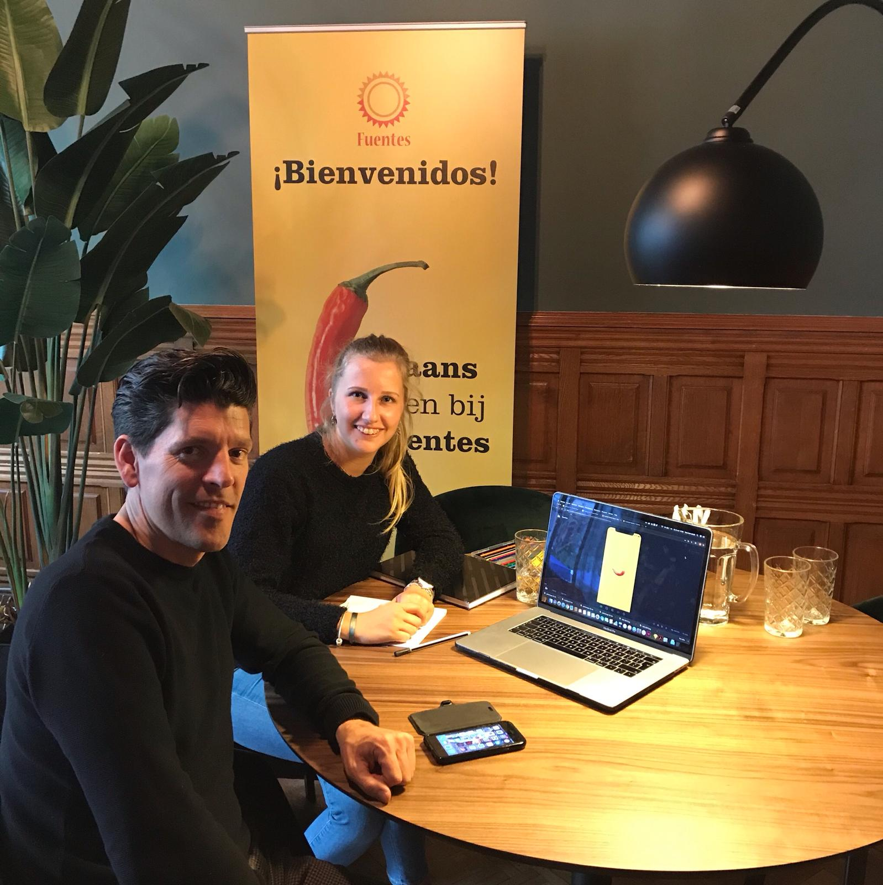

# Feedback Fuentes 9 mei

Donderdag 9 mei bezocht ik het hoofdkantoor van Fuentes in Rotterdam. Hier liet ik hun mijn huidige prototype zien. Ik liep door de hele applicatie heen en door het concept. Vervolgens konden zijn vragen stellen en feedback hierop geven. Hierna liet ik twee medewerksters van Fuentes de applicatie testen. Lees hier alles over de usability tests met hun twee medewerksters Lorrain & Marieke:





### Hieronder is de feedback van Michiel en Otto te lezen:

* Geef in de balk boven de games duidelijker aan hoever in het spel ze zijn. Werk bijvoorbeeld in blokken, dus voeg streepjes toe in de balk zodat gebruikers zien hoeveel vragen ze nog moeten. Je kan dan ook werken met grotere en kleinere blokken als een vraag gemiddeld langer of korter duurt.
* Wat gebeurt er als een gebruiker tijdens het spel het spel afsluit? Worden de tot dat behaalde punten wel meegerekend? Wat staat er precies gecommuniceerd in de melding naar de cursisten?
* Stuur gebruikers tijdens de spreek-game naar welk antwoord je van ze verwacht. Geef al een voorbeeld zin per vraag zodat ze weten hoe ze het antwoord moeten opbouwen. Bijvoorbeeld: "Ana is de ... van Maria".
* Denk goed na over het menu en de navigatie in vergelijking met het menu en de navigatie van Fuentes.nl. Maak bewust dit menu in een contra-kleur of maak duidelijk dat je nu in een ander sub element zit.
* Blok spelletjes als er niet genoeg wordt geoefend.
* Is er terug te zien hoever je in een spel was of hoeveel punten je per spel hebt behaald? Is dit over te doen en af te maken? De spellen moeten niet meteen opnieuw te spelen zijn. Dit is niet eerlijk, want dan weten gebruikers de antwoorden nog. Zorg dat er na bijvoorbeeld 7 dagen een notificatie wordt gegeven waardoor gebruikers weten dat ze een spel af kunnen maken/opnieuw kunnen proberen te spelen.
* Als je score \(7 dagen\) voldoende is, wat dan? Wat gebeurt er boven de 10.000? Hoe weet je dat je 7 dagen boven de 10.000 zit?
* Hoeveel spelletjes zijn er te zien? Op de manier hoe het nu weergeven is is het niet zo veel. En je ziet niet in 1 oogslag hoeveel er zijn.
* Als een spel geblokkeerd is, misschien triggert het juist wel/niet als gebruikers nog niet zien welk spel met thema en aantal punten eronder zit verwerkt. Misschien is een slotje een duidelijk icoon om te laten zien dat het spel nog niet te spelen is.

