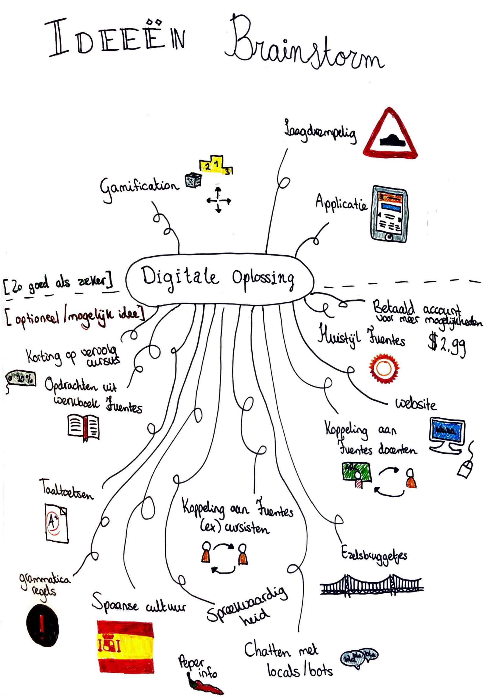

# Ideeën brainstorm

Hier ging ik breed na denken over mogelijke ideeën. De ideeën boven de streepjeslijn zijn ideeën die zo goed als vast staan en onder de lijn de ideeën die optioneel zijn. Waar dus nog verder naar onderzocht moet worden.

