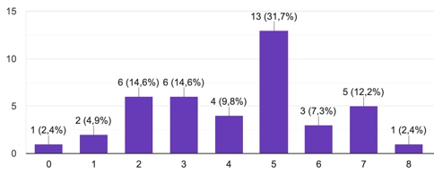

# Inleiding

  
Een halfjaar nadat ik de minor ‘Spaanse taal en Cultuur’ had afgerond, merkte ik dat ik de kennis over de Spaanse taal erg snel aan het verleren was. Ik vroeg mij af of ik de enige ben die snel een extra geleerde taal verleerd. Dankzij een enquête, die ik opstelde en door 44 respondenten beantwoord werd, kreeg ik de bevestiging dat ook anderen met dit probleem kampten. Gemiddeld gaven de respondenten zichzelf 6 jaar na de laatste les nog maar gemiddeld een 4,03 van de 10,0 \(zie afbeelding 1\) wat hun taalkennis betreft.  Ik vond dit schrikwekkend en daarom erg interessant om mijn afstudeerproject te houden over: talen verleren. Ik doe dit onderzoek bij de Spaanse taalschool Fuentes. 

**Design challenge:** Hoe kan een digitale oplossing ervoor zorgen dat cursisten van Fuentes, en alle andere Nederlanders die Spaans hebben geleerd, hun behaalde niveau kunnen blijven beheersen na het afronden van Spaanse lessen, waarbij het gebruiken van de digitale oplossing er voor zorgt dat Fuentes meer cursisten krijgt die een \(vervolg\)cursus nemen?  

Aangezien ik van extra uitdaging hou, heb ik mezelf twee uitdagingen gegeven:

1. Zorgen dat cursisten van Fuentes en alle andere Nederlanders die Spaans hebben geleerd hun taaniveau blijven beheersen na het afronden van Spaanse lessen.

2. Zorgen dat gebruikers van de digitale oplossing een \(vervolg\)cursus willen volgen bij Fuentes.

> Afbeelding 1. \[screenshot\]. Schaik, van Y. Geraadpleegd op 1 februari 2019, van: [https://docs.google.com/forms/d/1ohQHO9XJzxrZdzm8SXM6UDayKYwzVs6PO8yG-\_ZzW9E/edit](https://docs.google.com/forms/d/1ohQHO9XJzxrZdzm8SXM6UDayKYwzVs6PO8yG-_ZzW9E/edit)

