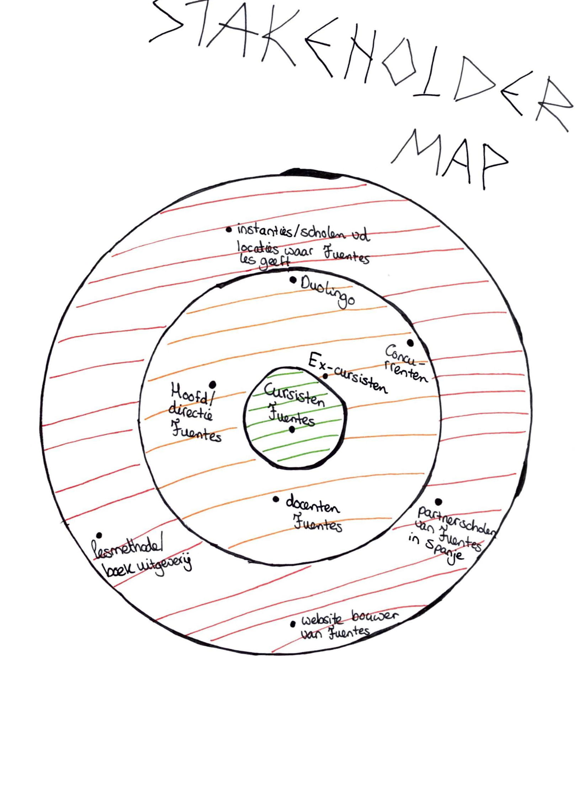

# Stakeholdermap

Hieronder is een stakeholdermap te zien. Dit houdt in dat de stakeholders in het midden het dichtsbij het project staan. Dit zijn dus stakeholders die de meeste invloed en profijt hebben en het product het meeste zullen gaan gebruiken of er mee in verbang zullen staan. Hoe verder een stakeholder van het middenpunt af staat hoe minder deze stakeholder met dit project te maken heeft.

Hier is te zien wat de wensen, behoeftes, leuke ideeën en eisen van de stakeholders zijn:



