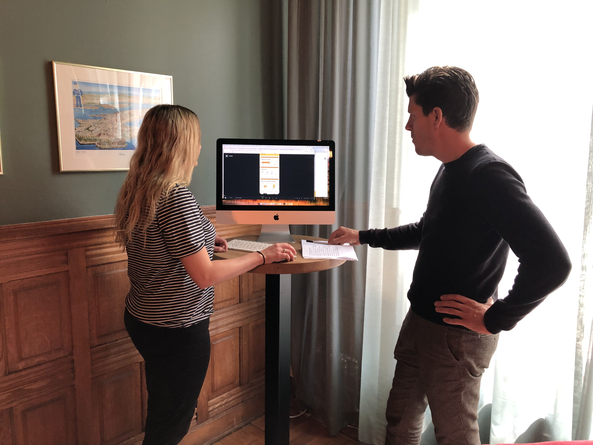

# Marieke \(hoofdkantoor Fuentes\) - 9 mei

Marieke is medewerkster op het hoofdkantoor van Fuentes. Zij voerde een usability test uit op 9 mei. 

* De uitleg van de progressbar: start met dat je maar 600 punten max per dag mag verdienen. Als laatste vertel je pas over die 10.000 punten. Benoem wel aan het begin dat er kado's te verdienen zijn. Werk met bullets en meerdere punten per swipe. 
* Maak de vinkjes bij de regels van de puntentelling groen in plaats van rood. Rood wordt geassocieerd met iets fouts.
* Zeg na de uitleg van de progressbar iets in de vorm van: "Gefeliciteerd. Je krijgt 5000 punten kado.". Dit is erg motiverend.

