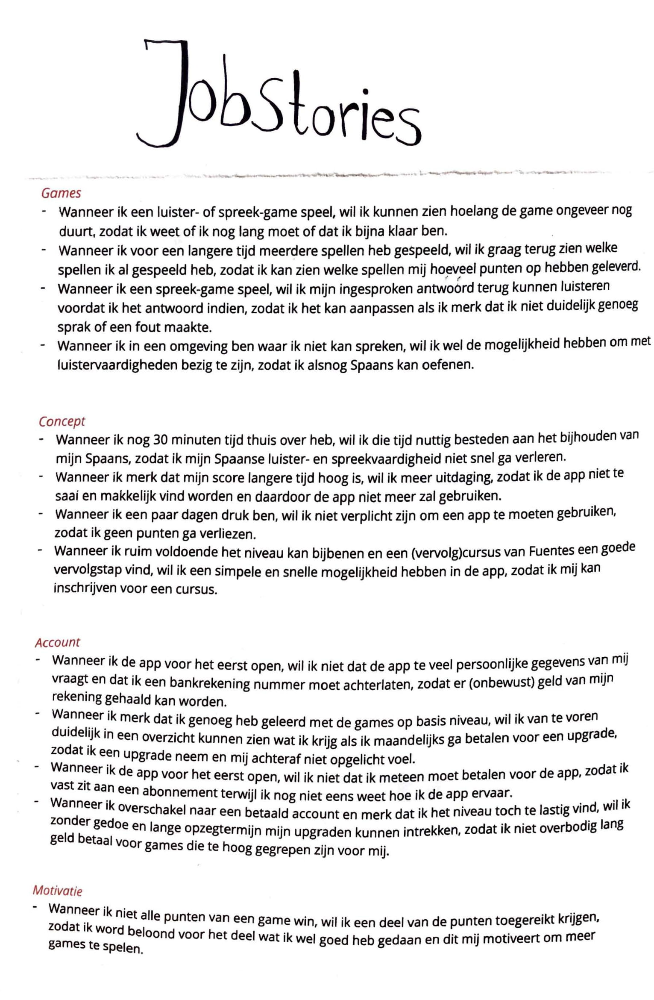

# Jobstories

When \(situation\), I want \(motivation\), so I can \(expect outcome\)

Games

* Wanneer ik een luister- of spreek-game speel, wil ik kunnen zien hoelang de game ongeveer nog duurt, zodat ik weet of ik nog lang moet of dat ik bijna klaar ben.
* Wanneer ik voor een langere tijd meerdere spellen heb gespeeld, wil ik graag terug zien welke spellen ik al gespeeld heb, zodat ik kan zien welke spellen mij hoeveel punten op hebben geleverd.
* Wanneer ik een spreek-game speel, wil ik mijn ingesproken antwoord terug kunnen luisteren voordat ik het antwoord indien, zodat ik het kan aanpassen als ik merk dat ik niet duidelijk genoeg sprak of een fout maakte.
* Wanneer ik in een omgeving ben waar ik niet kan spreken, wil ik wel de mogelijkheid hebben om met luistervaardigheden bezig te zijn, zodat ik alsnog Spaans kan oefenen.

Concept

* Wanneer ik nog 30 minuten tijd thuis over heb, wil ik die tijd nuttig besteden aan het bijhouden van mijn Spaans, zodat ik mijn Spaanse luister- en spreekvaardigheid niet snel ga verleren.
* Wanneer ik merk dat mijn score langere tijd hoog is, wil ik meer uitdaging, zodat ik de app niet te saai en makkelijk vind worden en daardoor de app niet meer zal gebruiken.
* Wanneer ik een paar dagen druk ben, wil ik niet verplicht zijn om een app te moeten gebruiken, zodat ik geen punten ga verliezen.
* Wanneer ik ruim voldoende het niveau kan bijbenen en een \(vervolg\)cursus van Fuentes een goede vervolgstap vind, wil ik een simpele en snelle mogelijkheid hebben in de app, zodat ik mij kan inschrijven voor een cursus.

Account

* Wanneer ik de app voor het eerst open, wil ik niet dat de app te veel persoonlijke gegevens van mij vraagt en dat ik een bankrekening nummer moet achterlaten, zodat er \(onbewust\) geld van mijn rekening gehaald kan worden.
* Wanneer ik merk dat ik genoeg heb geleerd met de games op basis niveau, wil ik van te voren duidelijk in een overzicht kunnen zien wat ik krijg als ik maandelijks ga betalen voor een upgrade, zodat ik een upgrade neem en mij achteraf niet opgelicht voel.
* Wanneer ik de app voor het eerst open, wil ik niet dat ik meteen moet betalen voor de app, zodat ik vast zit aan een abonnement terwijl ik nog niet eens weet hoe ik de app ervaar.
* Wanneer ik overschakel naar een betaald account en merk dat ik het niveau toch te lastig vind, wil ik zonder gedoe en lange opzegtermijn mijn upgraden kunnen intrekken, zodat ik niet overbodig lang geld betaal voor games die te hoog gegrepen zijn voor mij.

Motivatie

* Wanneer ik niet alle punten van een game win, wil ik een deel van de punten toegereikt krijgen, zodat ik word beloond voor het deel wat ik wel goed heb gedaan en dit mij motiveert om meer games te spelen.

