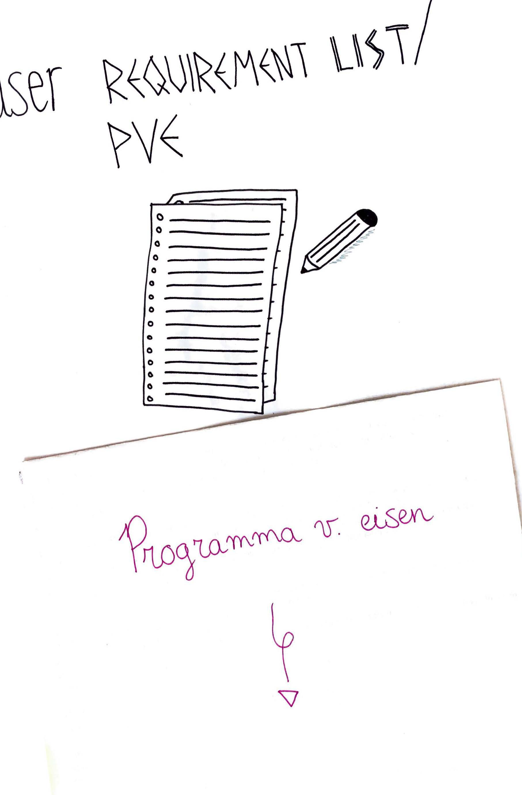

# Programma van Eisen 6 mei

Deze Programma van Eisen zijn gebaseerd op eisen vanuit het hoofdkantoor van Fuentes en de wensen behoeftes van cursisten en andere stakeholders die ik ontdekt heb tijdens de onderzoeken. Deze versie is herschreven aan de hand van onderzoeken die tussen 20 maart en 6 mei zijn gedaan.



**Uit de opdracht…**

Het product moet een interactieve digitale oplossing zijn.

Het product moet tot een werkend prototype uitgewerkt worden.

Het product moet een design rationaal krijgen over het product.

Het product moet een product biografie krijgen over het product.

Het product moet een reflectie krijgen over het proces van het product.

**Opdrachtgever \(bedrijf, merk\)…**

Het product moet niet zorgen dat cursisten alleen nog maar de oplossing willen gebruiken en niet terug willen komen bij een vervolgcursus van Fuentes.

Het product moet zorgen dat er geld binnen komt bij Fuentes.

Het product moet de gebruikers hetzelfde vertrouwde gevoel geven als tijdens de lessen van Fuentes.

**Context eisen \(situatie, locatie\)…**

Het product moet in sommige situatie’s te gebruiken zijn waar geluid afgespeeld kan worden.

Het product moet in sommige situatie’s te gebruiken zijn waar gesproken kan worden tegen het product.

Het product moet tijdens korte momenten te gebruiken zijn, zoals in het openbaar vervoer.

Het product moet tijdens langere momenten te gebruiken zijn, wanneer iemand er de tijd voor wil nemen.

**Stakeholder eisen…**

Het product moet geen werk van de docenten van Fuentes afpakken.

Het product moet het hoofd van Fuentes toegang geven tot de achterkant van de applicatie.

Het product moet het hoofd van Fuentes inzichten geven in wat gebruikers vinden van de applicatie.

**Gebruikers eisen \(functioneel, emotioneel, sociaal\)…**

Het product moet geen \(dagelijkse\) verplichtingen geven.

Het product moet niet te veel tijd kosten.

Het product moet niet te veel effort en input kosten.

Het product moet niet te prijzig zijn.

Het product moet easy-to-use zijn.

Het product moet gamification bevatten. Hierdoor zijn gebruikers gemotiveerder om het product te gebruiken.

Het product moet gebruikers hun progress laten zien. Zodat zij in zien dat het product succesvol is.

Het product moet gebruikers niet onzeker maken over hun Spaanse taalkennis.

**Technologische eisen…**

Het product moet te gebruiken zijn door middel van een persoonlijke code die cursisten krijgen zodra zij een cursus afronden.

Het product moet te gebruiken zijn wanneer gebruikers offline zijn.

Het product moet te gebruiken zijn wanneer gebruikers online zijn.

**Functionele eisen…**

Het product moet de optie hebben om te kunnen spreken tegen het product.

Het product moet de optie hebben om het product audio te laten afspelen.

Het product moet de optie hebben om geluid harder en zachter te zetten.

**Vormeisen…**

Het product moet een huisstijl krijgen die grotendeels overeenkomt met de huidige huisstijl van Fuentes.

Het product moet iets kenmerkends hebben waardoor duidelijk is dat het wel bij Fuentes hoort, maar een ander platform van Fuentes is.

Het product moet qua look-and-feel rekening houden alle leeftijden van 18 tot 99 jaar.

Het product moet niet een uitstraling hebben die te fancy is.

