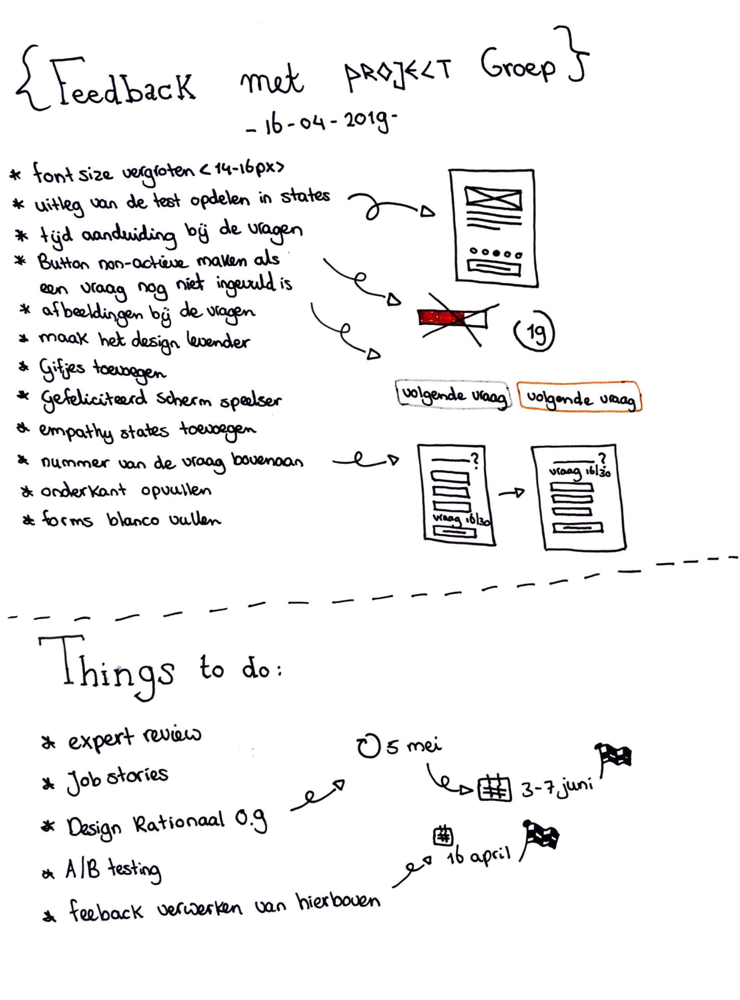

# Wekelijkse bijeenkomst 16 april

Dinsdag 16 april kreeg ik in plaats van enkel van Marianne ook feedback van mijn medestudenten Armand, Niels en Suzanna. De feedback is hieronder te lezen.

* font size 14/16 px
* Uitleg test opdelen in deeltjes met onboarding feeling
* Tijd aanduiding bij de testvragen
* Button non-active maken als er geen vraag ingevuld is
* Plaatjes bij de vragen
* Maak alles speelser
* GIFjes
* Gefeliciteerd scherm sprekender maken
* Empathy states
* Vraagnummer bovenaan

