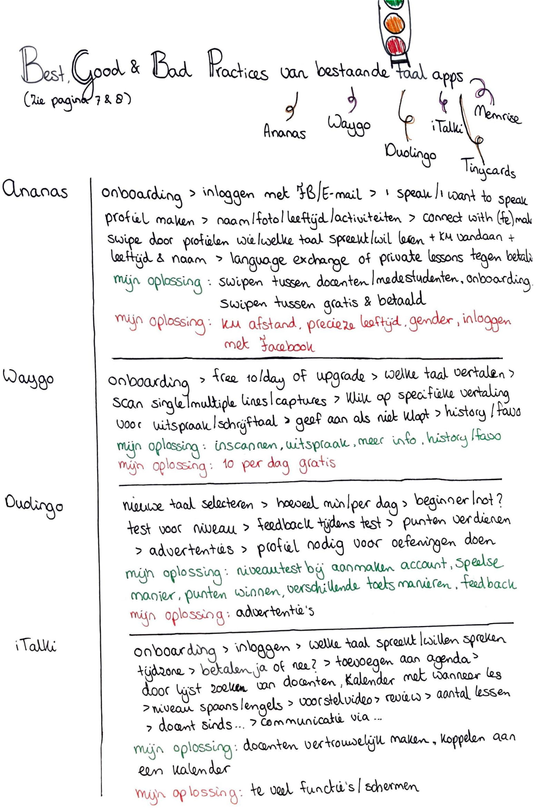
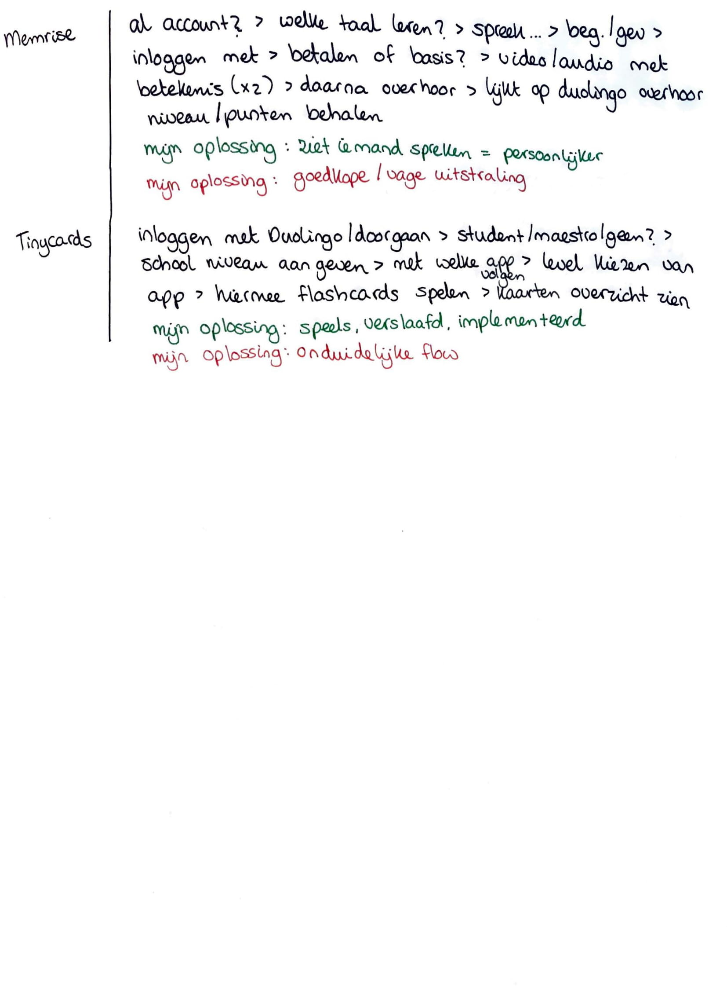

# Best, good and bad practices

  
Één van de eerste onderzoeken die ik heb uitgevoerd zijn Benchmark creation en Best, good and bad practices. Ik heb bewust ervoor gekozen om deze onderzoeksmethodes al vroeg toe te passen. Ik wilde graag goede voorkennis hebben over bestaande taal- websites en applicaties. Vervolgens wetende dat ik bepaalde aspecten interessant vind en verder op wil focussen. En welke aspecten ik verder wil onderzoeken, omdat ik denk dat deze niet krachtig zijn.

  
Hierboven is de Benchmark creation te zien. Ik omschreef in korte steekwoorden wat ik positief en negatief vond opvallen van de vijf grootste taalapps. Op afbeelding 3 omschreef ik wat de volgorde van de app is zodra je het download tot en met het gebruik ervan. Gevolgd door welke punten ik daarvan graag terug zie in mijn digitale oplossing en welke niet. Gebaseerd op wat ik als fijn ervaarde en wat niet. 

Ik had op Duolingo na nog geen ervaring met de apps en de websites ’Forvo’ en ‘Omniglot’. Ik heb alle apps gedownload, waar nodig was een account aangemaakt en de app gebruikt voor twee dagen. Zo had ik een goed beeld van de werking van de apps.  

**Punten die mij opvielen in de bestaande taalapps:**

* Ingevulde antwoorden worden snel fout gerekend. Bijvoorbeeld als je een zin in een andere volgorde zet terwijl dit grammaticaal correct is. 
* Gebruikers van Duolingo moeten een niveautest doen zodra ze de app voor het eerst gebruiken. Zo gaat de app vervolgens op het juiste niveau verder
* Je kan chatten met locals uit het buitenland, maar je weet niet of deze personen betrouwbaar zijn en/of taalfouten maken.
* Je leert enkel basis woorden en zinnen, maar niet om een diepgaande conversatie te kunnen voeren.

