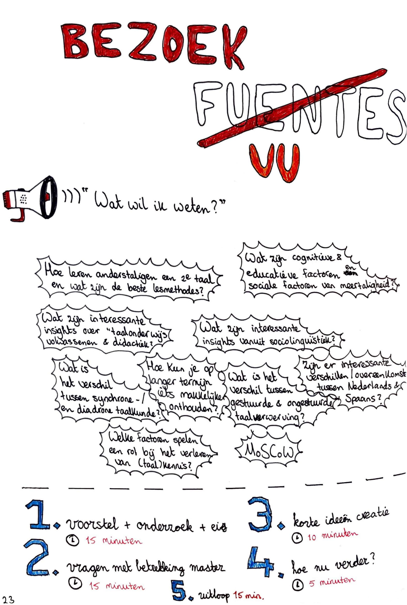
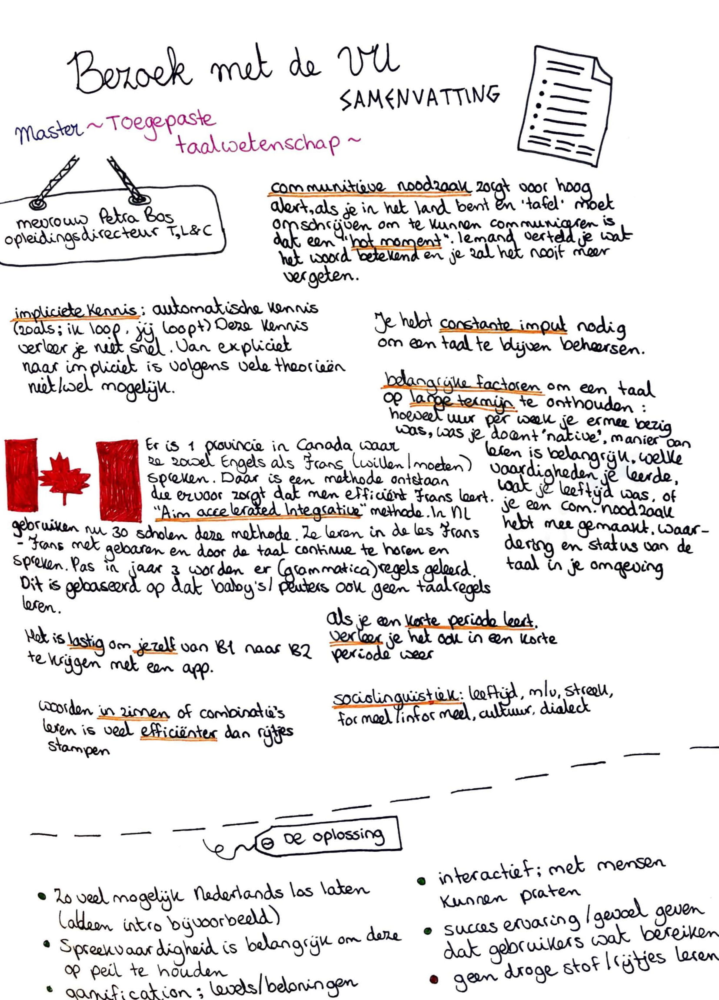

# Bezoek master Toegepaste Taalwetenschap - VU

Mij lijkt het super interessant om meer te weten te komen over hoe wij een taal leren. Uiteraard had ik hier al onderzoek naar gedaan. Zie Onderzoek &gt;  Desk Research &gt; Hoe leren wij een nieuwe taal?. Ik wilde meer diepgang en graag een gesprek hebben waarbij een expert een beargumenteerde mening kon geven over wat hij/zij van de huidige lesmethodes vindt hoe wij mensen een taal leren op scholen. Ik mailde wat heen en weer met de Vrije Universiteit van Amsterdam en regelde een meeting met een docente van de master Toegepaste Taalwetenschap. Hieronder is alles te lezen wat hier uit kwam.

  
Meeting VU Petra Bos \(docente van de opleiding\):

* het is erg lastig om je zelf van B1 naar B2 te krijgen met mijn oplossing
* Impliciet kennis is kennis die onbewust gaat, wij weten met onze moeder taal dat het is: ik loop, maar iemand die Nederlands als 2e taal heeft moet hierover nadenken. Er zijn veel theorieën of het wel mogelijk is om van expliciet naar impliciet te gaan als het niet je moeder taal is. Ontkrachten is makkelijker dan 100% bevestigen
* De VU heeft een vak genaamd ‘vreemde talen’vak
* Herhalen is de key tot lange termijn onthouden
* Als je een taal goed kent, dan beetje verleert en eenmaal weer hoort is het in het begin lastig maar komt het snel weer terug
* Als je in een korte periode leert, verleer je het ook weer in een korte periode. Leer je langer, dan onthoud je het langer
* Communicatieve noodzaak zorgt voor hoog alert, als je in een land bent waar je het woord ‘tafel’ moet omschrijven om te kunnen communiceren en dit eenmaal vraagt onthoud je het langer en zal je altijd denken aan dat moment en dat woord langer onthouden dan een basiswoord die je vaak moet gebruiken maar in een rijtje woordjes hebt geleerd. Dit is een hot moment, je moet het woord weten en komt in een ongemakkelijke situatie als je het niet weet en niet verstaanbaar wordt. -&gt; Awareness &gt; constante input, dus steeds de taal horen en toepassen en spreken
* Woorden in zinnen/combinaties leren is beter dan in rijtjes leren.
* Cognitieve factoren zijn; ben je intro- of extrovert, ben je leergierig, heb je dyslextie, genre bij pubers die niet willen falen in de klas, snel leers etc
* Baby’s en peuters horen de hele dag klanken en belangrijke dagelijkse woorden en dit zorgt ervoor dat je het leert
* Aim accelerated integrative method - frans frans leren in Nederland, 30 scholen, met handgebaren wordt er geleerd en voornamelijk eerst alleen mondeling en verstaan pas na 3 jaar grammatica en regels. In Canada is 1 provincie waar engels en frans de hoofdtaal is en iedereen leert beide talen
* Ongestuurde taalverwerving is onbewust leren van de taal + toepassen
* NL is Germaans en Frans en Spaans romeins. Komt een taal uit dezelfde groep, dan is het meteen makkelijker om de andere taal uit die groep te leren, begrijpend lezen wel, maar schrijven vaak niet
* Synchornisch en didactisch gaat over verschil van de taal vroeger en nu en tussen dialecten
* Positieve en negatieve transfer tussen talen
* Sociolinguistiek gaat niet alleen over cultuur, maar ook over m/v, leeftijd, streek, formeel/informeel
* Manier van leren is heel belangrijk of je het niet snel verleerd, hoeveel uur per week je leerde, of de docent native was, welke vaardigheden je leerde, of je herhaald, of je communicative noodzaak had, leeftijd toen je leerde, waardering/status van de taal,

Wat wel in de app moet:

* wel of niet Nederlands, of alleen het intro \(anders schrikt het misschien af\)
* Manier van leren/de opdrachten/methode
* Leuk zijn, op de geest inspelen, gamen met levels/beloningen
* drang/uitdaging moet je voelen
* Interactief
* Mensen met elkaar kunnen praten, of met chatbots
* Succes ervaring, ze moeten zelf zien dat het werkt en het helpt en je gevoel geeft dat je iets bereikt hebt
* Spreekvaardigheid is belangrijk, moet op peil blijven, spreken is het belangrijkste wat mensen willen kunnen doen 

Wat niet in de app moet:

* Voorkomen dat het niet saai is, geen regeltjes woordjes leren dus 

> * Afbeelding 1. \[eigen foto uit logboek\]. Schaik, van Y. Bezoek VU. Geraadpleegd op 7 maart 2019.
> * Afbeelding 2. \[eigen foto uit logboek\]. Schaik, van Y. Bezoek VU. Geraadpleegd op 7 maart 2019.
> * VU. z.d. Taalwetenschappen: Toegepaste Taalwetenschap - Master's degree programmes - Master's programmes Vrije Universiteit Amsterdam. \(z.d.\). Geraadpleegd op 10 februari 2019, van [https://masters.vu.nl/en/programmes/taalwetenschappen-toegepaste-taalwetenschap/index.aspx](https://masters.vu.nl/en/programmes/taalwetenschappen-toegepaste-taalwetenschap/index.aspx)
> * Wilsum, G. z.d. Na je afstuderen. Geraadpleegd op 1 maart 2019, van: [https://students.uu.nl/gw/taalwetenschap/studieprogramma/na-je-afstuderen](https://students.uu.nl/gw/taalwetenschap/studieprogramma/na-je-afstuderen)
> * VU. z.d. Toegepaste Taalwetenschap. Geraadpleegd op 1 maart 2019, van: [https://masters.vu.nl/en/programmes/taalwetenschappen-toegepaste-taalwetenschap/index.aspx](https://masters.vu.nl/en/programmes/taalwetenschappen-toegepaste-taalwetenschap/index.aspx)
> * UU. z.d. Meertaligheid en taalverwerving. Geraadpleegd op 1 maart 2019, van: [https://www.uu.nl/masters/meertaligheid-en-taalverwerving](https://www.uu.nl/masters/meertaligheid-en-taalverwerving)
> * van Oostendorp, M. \(2016, 7 juni\). Hoe nuttig is sociolinguistiek? Geraadpleegd op 4 maart 2019, van: [https://www.neerlandistiek.nl/2016/06/hoe-nuttig-is-sociolinguistiek/](https://www.neerlandistiek.nl/2016/06/hoe-nuttig-is-sociolinguistiek/)
> * HvA. z.d. Studiegids Leraar Nederlands. Geraadpleegd op 1 maart 2019, van: [https://studiegids.hva.nl/studiegids?edu=lrned-vt&acy=2017-2018](https://studiegids.hva.nl/studiegids?edu=lrned-vt&acy=2017-2018)

