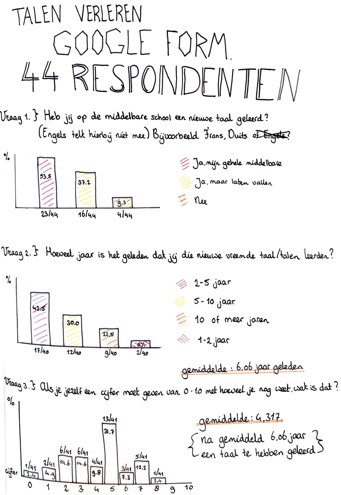
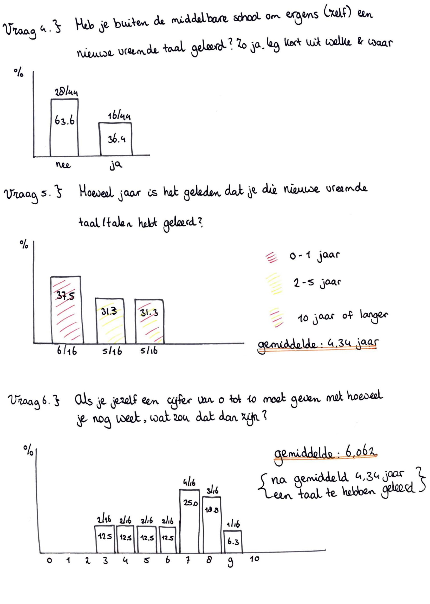

# Enquete vooronderzoek \(44 respondenten\)

Ik vroeg mij af of ik de enige was die snel de kennis van een extra geleerde taal vergat. Hierdoor had ik een enquete opgesteld om dit te onderzoeken. Hieruit wilde ik weten of meerdere mensen dit probleem  herkende of niet. Ik stelde een enquête op. Kijk onder de afbeeldingen voor de vragen en antwoorden.

Link naar de enquête: [https://docs.google.com/forms/d/e/1FAIpQLSe6KlvTHtkkO-v3FWcx\_skv4TG1kHKKjBHf4d2-HAU-dbegAw/viewform?usp=sf\_link](https://docs.google.com/forms/d/e/1FAIpQLSe6KlvTHtkkO-v3FWcx_skv4TG1kHKKjBHf4d2-HAU-dbegAw/viewform?usp=sf_link)

**Vraag 1.** Heb jij op de middelbare school een nieuwe taal geleerd \(Engels telt hierbij niet mee\) bijvoorbeeld Frans, Duits of Spaans?

**Antwoorden:**

0 Ja mijn gehele middelbare school periode 1 of meerdere nieuwe vreemde talen

0 Ja, maar ik heb het op een gegeven moment laten vallen gedurende de middelbare school

0 Nee ik heb alleen Engels en Nederlands geleerd \(door naar vraag 4\)

0 Anders, namelijk: ...

**Vraag 2.** Hoeveel jaar is het geleden dat je die nieuwe vreemde taal/talen hebt geleerd?

**Antwoorden:** 

0 0-1 jaar geleden

0 1-2 jaar geleden

0 2-5 jaar geleden

0 5-10 jaar geleden

0 langer dan 10 jaar geleden

**Vraag 3.** Als je jezelf een cijfer van 0 tot 10 moet geven met hoeveel je nu nog weet van de vreemde taal/talen die je geleerd hebt, wat zou je die taal/talen dan geven?

**Antwoorden:**

Ik weet helemaal niks meer van de taal 0 - Ik weet alles nog van de taal 10

**Vraag 4.** Heb je buiten de middelbare school om ergens \(zelf\) een nieuwe vreemde taal geleerd? Zo ja, leg kort uit welke taal en hoe je deze taal geleerd hebt. Zo nee, einde van deze enquete :\)

**Vraag 5.** Hoeveel jaar is het geleden dat je die nieuwe vreemde taal/talen hebt geleerd?

**Antwoorden:**

0 0-1 jaar geleden

0 1-2 jaar geleden

0 2-5 jaar geleden

0 5-10 jaar geleden

0 10 jaar of langer

**Vraag 6.** Als je jezelf een cijfer van 0 tot 10 moet geven met hoeveel je nu nog weet van de vreemde taal/talen die je geleerd hebt, wat zou je die taal/talen dan geven?

**Antwoorden:**

Ik weet helemaal niks meer van de taal 0 - Ik weet alles nog van de taal 10

Dankzij de enquête die ik opstelde en door 44 respondenten beantwoord is, heb ik de bevestiging dat ik niet alleen ben \(bron 1\). Gemiddeld gaven de respondenten zichzelf, 6 jaar nadat de taal voor het laatst geleerd is, nog maar een 4,03 met wat zij aan kennis nog weten van de middelbareschool. In vergelijking met mensen van de enquête die zelf kozen om ergens anders nog een taal te leren gaven zij zichzelf nog een 6,10. Hieruit blijkt dat mensen die zelf kiezen om een extra taal te leren minder snel de taalkennis verliezen zodra zij stoppen met het leren van deze taal. Mijn aanname hiervoor is dat deze mensen meer motivatie hebben, doordat zij zelf kiezen om een nieuwe taal te leren in plaats van dat een school je verplicht om een extra taal te leren.

