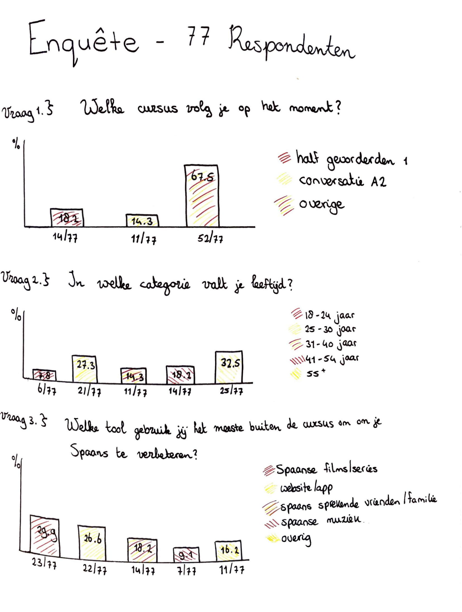
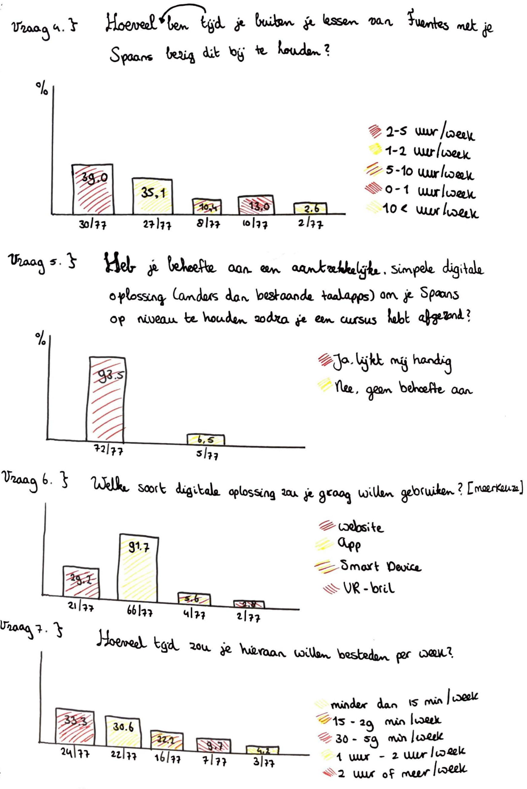

# Enquete context cursisten \(77 respondenten\)

Ik heb een enquête opgesteld samen met het hoofd van Fuentes om een goed beeld te krijgen van hun cursisten. De enquête werd door 77 cursisten van Fuentes door heel Nederland ingevuld. Op afbeelding 4 zijn de vragen en resultaten te zien. Uit de enquête blijkt dat 26,6% van de respondenten een website of app gebruikt, buiten de cursus om, om Spaans te oefenen. Dit is op Spaanse films en series na de meest gebruikte tool \(29,9%\). Dit geeft aan dat een app of website een veel gebruikte tool is om Spaans te oefenen voor de cursisten. Dit was voor mij een interessante inzicht. 

Link naar de enquête: [https://docs.google.com/forms/d/e/1FAIpQLSd1-5jESqgqsgHb-X5PulnrMPtae9P05q5oMJHBhDRrFn5m2g/viewform?usp=sf\_link](https://docs.google.com/forms/d/e/1FAIpQLSd1-5jESqgqsgHb-X5PulnrMPtae9P05q5oMJHBhDRrFn5m2g/viewform?usp=sf_link)

**Belangrijke conclusies uit de enquête:**

*  Met 32.5% is de grootste leeftijdscategorie 55+.
* Gevolgd door 27,3% met cursisten van 25-30 jaar
* 39% besteedt buiten de cursus om 2-5 uur per week aan de Spaanse taal.
* 93.5% heeft behoefte aan een digitale oplossing die ervoor zorgt dat zij na het afronden van hun cursus de taal kunnen blijven oefenen.
* 91.7% hiervan ziet deze digitale oplossing graag in de vorm van een applicatie.
* 33.3% zou hier 30-59 minuten per week aan willen besteden.

