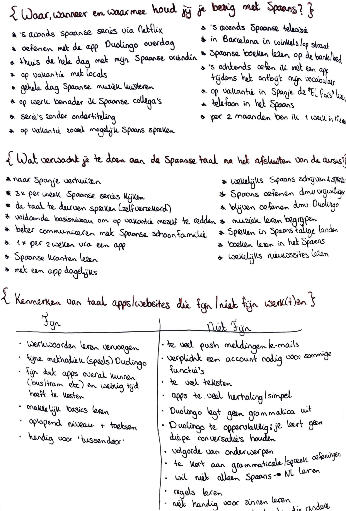

# Survey \(17 cursisten\)

**De belangrijkste conclusies uit de surveys met cursisten:**

* De cursisten leren Spaans, omdat ze: de taal mooi vinden, ze familie in/uit een Spaans sprekend land hebben of voor hun persoonlijke ontwikkeling.
* Bijna 80% is, buiten de Spaanse taal om, ook geïnteresseerd in de Spaanse cultuur.
* De meeste cursisten zijn voor of na school/werk bezig met de Spaanse taal door een Spaanse krant te lezen, een film/serie in het Spaans te kijken of ze gebruiken op de bank een taalapp.

Cursisten ervaren de volgende knelpunten bij bestaande taalapps:

* De apps zijn te simpel en bevatten te veel herhaling.
* De woorden en zinnen die je kan leren zijn te basaal en/of kort. 
* Je leert er niet/erg weinig een taal van te verstaan of spreken.
* Er worden vaak dingen fout gerekend die goed zijn doordat de zinsvolgorde van het juiste antwoord maar op één manier geprogrammeerd is.

