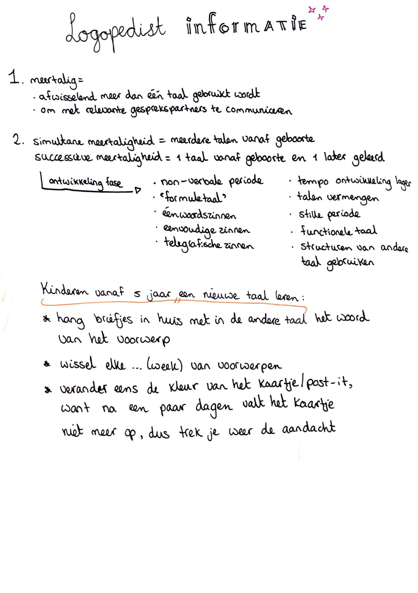

# Logopedist informatie

Mijn tante is logopedist. Zij is vijf dagen in de week bezig met hoe wij mensen een taal leren \(uitspreken\). Hierdoor leek het mij niet geheel onbelangrijk om ook van haar belangrijke informatie te ontvangen. Ik ontvang van haar de volgende dingen:



*  [https://www.kindentaal.nl/paginas/openbaar/meertaligheid/stimuleren/stimuleren-van-taal](https://www.kindentaal.nl/paginas/openbaar/meertaligheid/stimuleren/stimuleren-van-taal)
* [https://nt2spraak.nl/webinars/](https://nt2spraak.nl/webinars/) 

