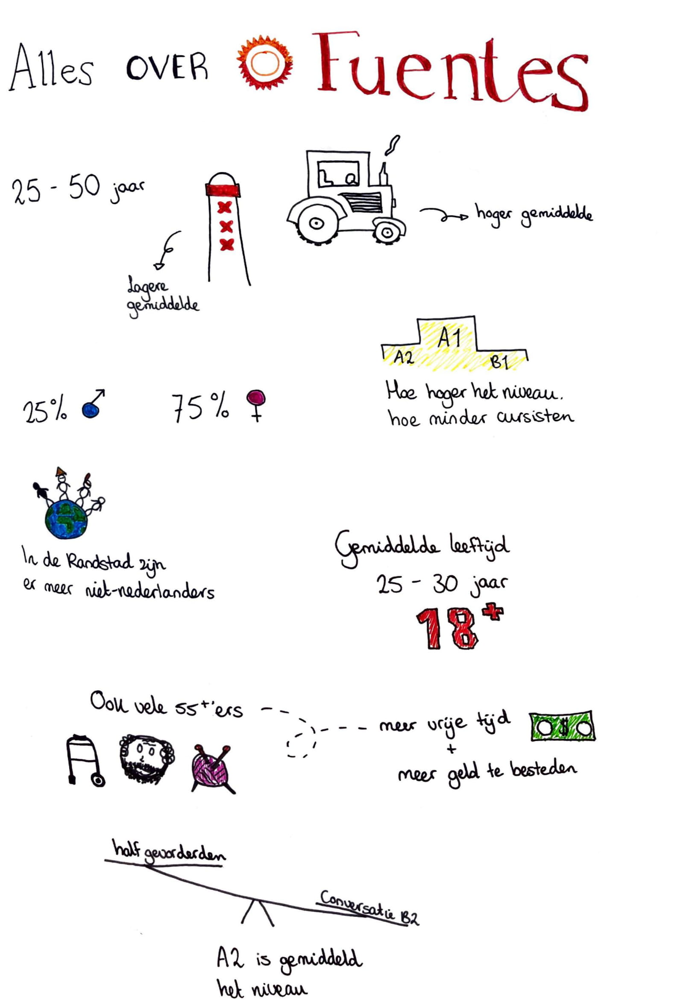

# Basis informatie over Fuentes/cursisten

Tijdens mijn 1e meeting met Fuentes kreeg ik antwoord op de meeste vragen die ik voorbereid had. \(Zie de link hieronder\). 



Hieronder is een samenvatting van deze antwoorden te vinden.

* In de randstad is de gemiddelde leeftijd lager
* In de kleinere dorpen is het gemiddelde hoger
* De gemiddelde leeftijd in heel Nederland is tussen de 25 en 50 jaar
* Hoe hoger het niveau van de cursus is hoe minder cursisten er zijn
* In de randstad zijn er meer niet-nederlanders
* Je moet minimaal 18 jaar en ouder zijn om een cursus te mogen volgen
* Er zijn ook veel 55+'ers, omdat zij meer tijd en geld hebben
* A2 is het gemiddelde niveau dat gevolgd wordt

