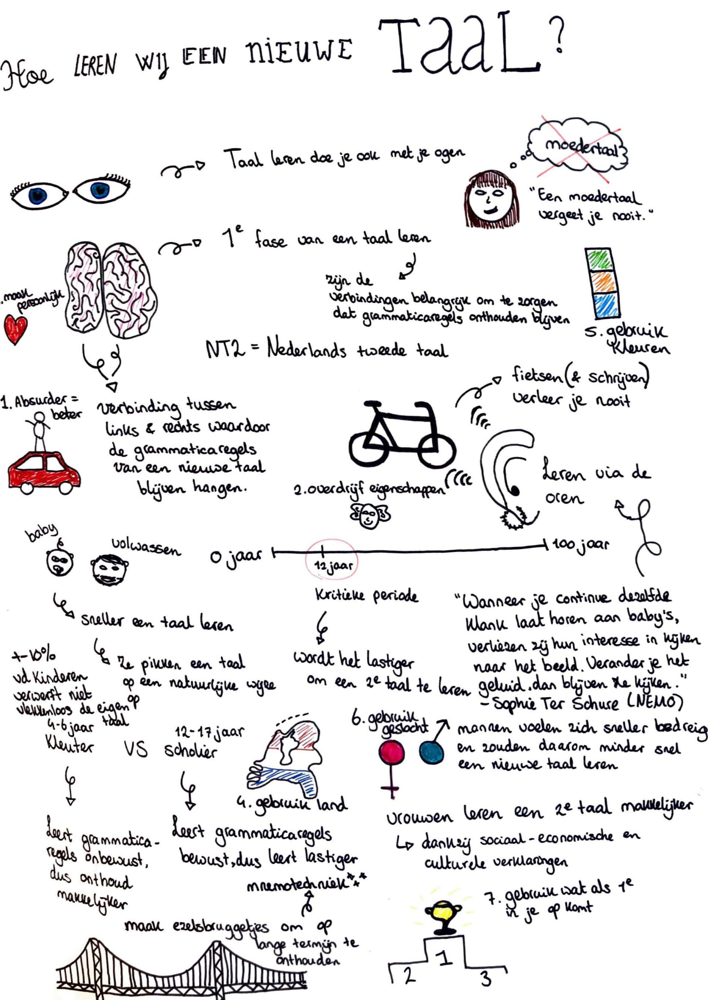

# Hoe leren wij een nieuwe taal?

Eén van de eerste dingen die ik ga onderzoeken is: 'Hoe leren wij een nieuwe taal?'. Ik ga heel internet af om naar interessante artikelen en onderzoeken te zoeken. Zo hoop ik vele informatie te vinden over hoe wij een taal leren.

Hieronder is op de afbeelding te zien wat ik aan informatie vond op deze onderzoeksvraag. Ook is hieronder een bronnenlijst te zien met interessante artikelen die ik vond.

> * Jansen, M. \(2016, 19 april\). Bekijk: Taal leren doe je ook met je ogen. Geraadpleegd op 2 februari 2019, van [https://www.nemokennislink.nl/publicaties/taal-leren-doe-je-ook-met-je-ogen/](https://www.nemokennislink.nl/publicaties/taal-leren-doe-je-ook-met-je-ogen/)
> * Je rechterhersenhelft en het leren van een nieuwe taal – Taalreis. \(2017, 19 oktober\). Geraadpleegd op 2 februari 2019, van [https://www.detaalreis.nl/je-rechterhersenhelft-en-het-leren-van-een-nieuwe-taal/](https://www.detaalreis.nl/je-rechterhersenhelft-en-het-leren-van-een-nieuwe-taal/)
> * Kooijman, M. \(2017, 5 november\). Dit is waarom je fietsen \(en schrijven\) nooit verleert. Geraadpleegd op 2 februari 2019, van [https://www.bedrock.nl/waarom-je-fietsen-nooit-verleert/](https://www.bedrock.nl/waarom-je-fietsen-nooit-verleert/)
> * Moedertaal vergeet je niet zelfs als je het nooit hebt gesproken. \(2017, 18 januari\). Geraadpleegd op 2 februari 2019, van [https://www.ad.nl/wetenschap/moedertaal-vergeet-je-niet-zelfs-als-je-het-nooit-hebt-gesproken~af31f6bf/](https://www.ad.nl/wetenschap/moedertaal-vergeet-je-niet-zelfs-als-je-het-nooit-hebt-gesproken~af31f6bf/)

