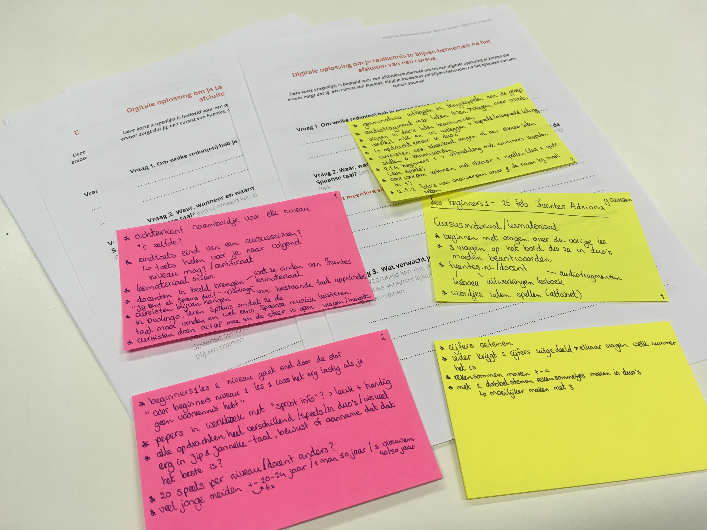
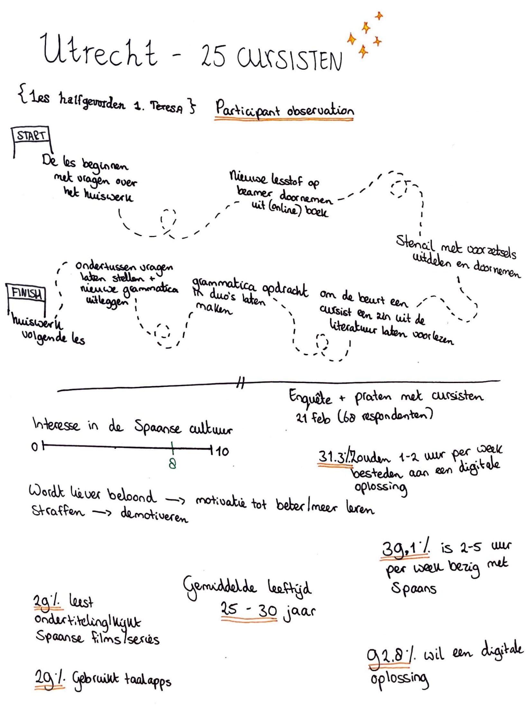
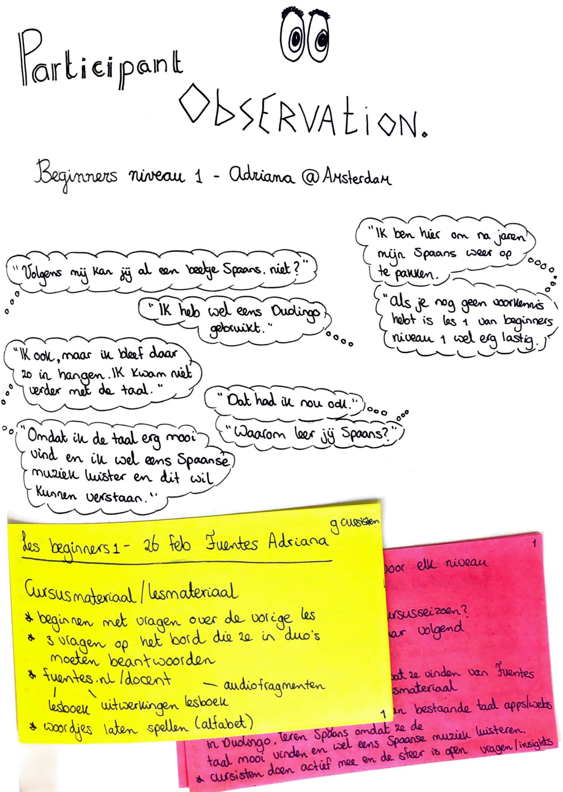

# Participant observation

Ik heb participant observations gedaan bij drie cursussen: twee in Utrecht en één in Amsterdam. Na afloop ben ik in gesprek gegaan met cursisten. Ik merkte tijdens de lessen hoe speels Fuentes omgaat met het les geven. Alle stof wordt op een speelse en praktische manier toegepast. Dit viel mij in positieve zin op. De cursisten reageerden ook positief en deden goed mee met de les. Aan het einde van de les vroeg ik aan een Spaans docente of zij bewust gebruik maakt van speelsheid in de les. Ook vroeg ik of dit iets is wat verplicht is vanuit Fuentes of dat het haar eigen keuze is. Ze vertelde dat dit wordt gestimuleerd door Fuentes, maar dat ze zelf ook veel positieve reactie’s erop krijgt. Daardoor leren cursisten sneller en makkelijker. Toen ik na de les met cursisten ging praten kwam ik tot interessante ondervindingen.

  

