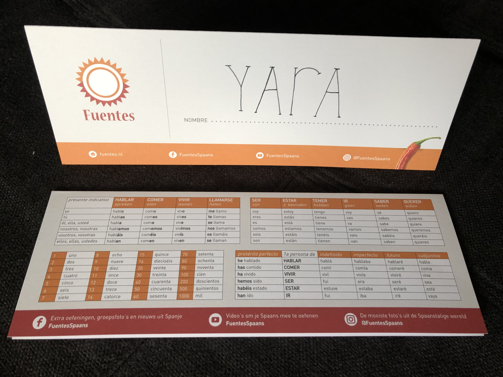
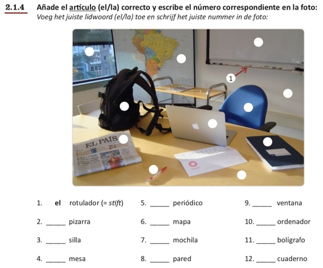
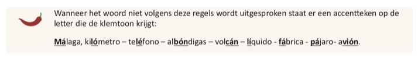

# Lesmethodes Fuentes offline + online

Tijdens de participant observation heb ik alle lesmateriaal goed bekeken. Aan het einde van de les heb ik met de docente gepraat over het overige lesmateriaal. Ook heb ik van Fuentes digitaal lesmateriaal mogen ontvangen om dit te mogen onderzoeken.

  
Tijdens de participant observation zag ik al interessante methodes voorbij komen. Het werkboek bestaat uit onder andere luister- spreek, kijk- en duo oefeningen. Fuentes heeft een eigen kanaal op YouTube en Soundcloud waar zij hun eigen gemaakte video’s en audio’s posten. De Spaans docente maakte onder andere gebruik van dobbelstenen. Hiermee moesten de cursisten in duo’s gaan dobbelen en vervolgens met de twee gegooide aantal ogen in het Spaans een rekensom maken om zo de Spaanse getallen te oefenen. Daarbij wordt er in de werkboeken gebruik gemaakt van blokken waar een pepertje in staat. Dit blok is gevuld met informatie over de Spaanse taal. Zie afbeelding 7 voor een voorbeeld hiervan. De reden dat ze een peper gebruiken is vanwege de slogan van Fuentes: “In een pittig tempo Spaans leren.”.

Op afbeelding 8 zijn alle soorten lesmethodes van Fuentes te zien. De overige oefeningen in het boek zijn oefeningen die zo speels mogelijk gemaakt zijn. Zie afbeelding 9 als voorbeeld.

**Wat ik hieruit mee neem in mijn digitale oplossing:**

- Ik wil dat mijn digitale oplossing ook speels is.

- Ik merk dat cursisten erg tevreden zijn over Fuentes en de lessen erg vertrouwd vinden. Ik wil dat mijn digitale oplossing ook vertrouwd over komt en cursisten hier tevreden over zijn.

- Ik wil de pepertjes overnemen in mijn digitale oplossing.

