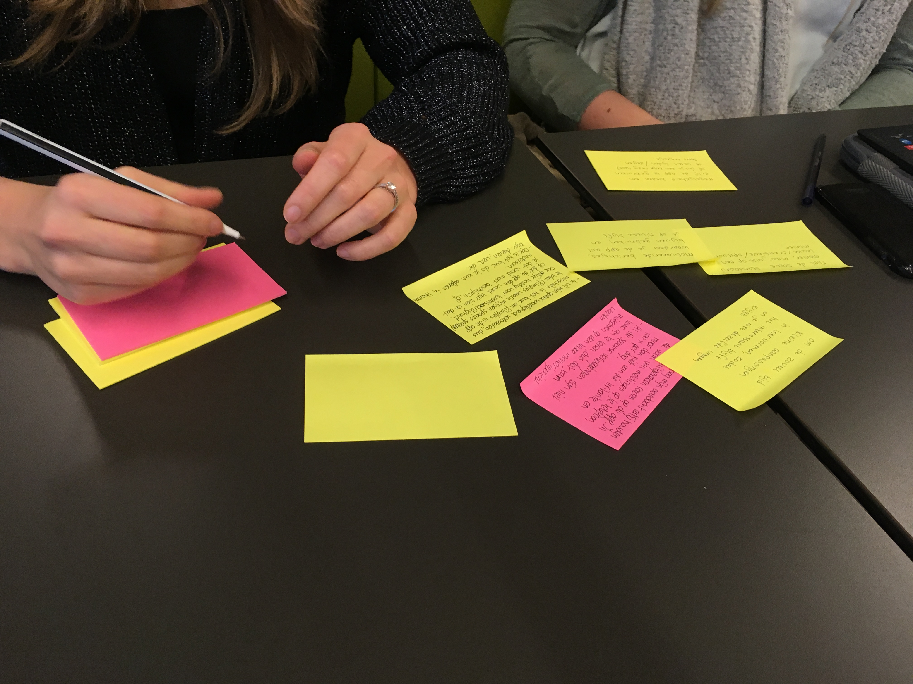
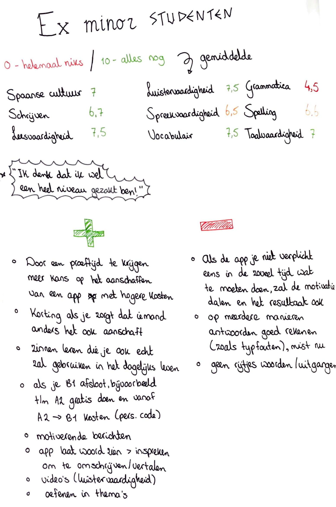
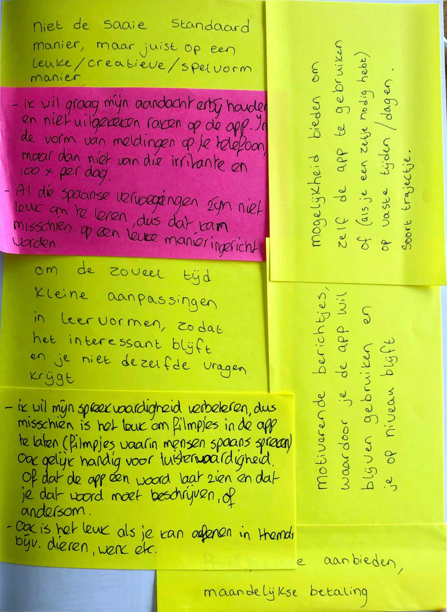

# Ex-minor Spaanse taal en cultuur studenten

###  **Helen** 

**Wat is achteraf jouw ervaring dat je 5 maanden lang intensief Spaans leerde in plaats van bijvoorbeeld een jaar lang wat rustiger aan?**

Goed, moeder deed 1-2 jaar, maar haalde zelfde niveau in langere tijd, maar zij onthouden minder doordat het zo uitgerekt was. Denkt dat het intensieve wel beter werkte!

**Wat vind je van de kennis over de Spaanse taal die je nu nog beheerst na 9 maanden?**

Stuk minder, wel geprobeerd bij te houden, maar te druk met andere dingen, school en werk, denkt dat ze nu op A2 niveau zit. Ze wilde het werkboek er af en toe bij pakken, maar gebeurde nooit. Wel soms artikelen op Facebook lezen, begrijpt wel veel, misschien net zoveel als 9 maanden geleden, maar spreken niet. Op werk wel geoefend soms als stewardess, herkende de vliegveldtermen.

**Van 0 \(ik weet niks meer\) tot 10 \(ik weet alles nog\) hoeveel kennis heb je nog voor de Spaanse Taalvaardigheden, Spelling, Grammatica, Vocabulaire,  Spreekvaardigheden, Luistervaardigheden, Leesvaardigheden, Schrijfvaardigheden en de Spaanse Cultuur?** 

\(geef een cijfer per onderwerp\)

Spaanse cultuur: 6, Schrijven: 6,5, leesvaardigheid: 7,5, luistervaardigheid: 7, spreekvaardigheid: 5, vocabulaire: 8, grammatica: 4, spelling 7,5 , taalvaardigheden 7

**Wat doe jij eraan om de taal blijven beheersen? Noem alles wat je gebruikt en geef graag aan per onderdeel of je het dagelijks, wekelijks of eerder maandelijks gebruikt**

Artikelen lezen op Facebook \(CNN en espanol\), dagelijks voorbij komen en dan titel lezen, 1x per 2 weken artikel echt openen en lezen en verder niks meer. Google translate 1x per 2 maanden voor Spaans. Spaanse serie gevolgd, ondertiteling soms op Spaans, maar 2 afleveringen. La casa de papel 2 weken gekeken, Jane the Virgin, 3 maanden, paar afleveringen per week 4/5 stuks. Spaanse muziek luisteren

**Wat mis jij nu in bestaande apps/websites waar jij de taal mee kan blijven oefenen/toepassen?**

Voor de minor niks gebruikt, geen woord kende ze, tijdens de minor geen tijd voor gehad. Dus alleen de minor en huiswerk

**Zou je maandelijks een klein bedrag betalen voor een apps/website die ervoor zorgt dat jij heel eenvoudig Spaans kan oefenen wanneer jij maar wil op een leuke en uitdagende manier die anders is dan alle andere bestaande taal apps/websites?** 

Als het echt een goed niveau is, zou ze wel 2/3 euro per maand er aan uit willen geven, maar dan moet die wel echt goed zijn. Zou wel bereid zijn om een cursus verder te volgen voor B1 niveau of verder gaan. Ze weet niet of ze echt een cursus zou gaan volgen, is bang om niks nieuws te leren omdat de minor zo intensief is. Zou wel 2x nadenken of ze het echt zou doen.

**Hoeveel euro zou jij maximaal per maand hiervoor betalen? Wetende dat de app/website wel echt een succes is en jij je Spaans nog jaren lang mee weet te beheersen?**

Onder de 5 euro, maar als de app echt helpt zou ze liever voor een app. Als het 1malige aankoop is zou ze Max 50 euro. Kan valkuil zijn als je met de app niet verplicht bent om het te volgen en dan zo ineens laat vervagen. Proeftijd om het eerst te ervaren, dan ben je misschien bereid om meer te betalen dan de 50 euro. Korting als je zorgt dat een vriend of vriendin het ook aanschaft. A2 niveau bijvoorbeeld gratis, en van A2 naar B1 betalen per maand.

### **Meike**

**Wat is achteraf jouw ervaring dat je 5 maanden lang intensief Spaans leerde in plaats van bijvoorbeeld een jaar lang wat rustiger aan?** 

Ik denk dat dit een heel goede start was om Spaans te leren, hierdoor kreeg je een stoomcursus en was je 5 maanden lang alleen hiermee bezig. Als je dit een jaar lang moet combineren met andere zaken lijkt het me lastiger om me 100% te focussen.

**Wat vind je van de kennis over de Spaanse taal die je nu nog beheerst na 9 maanden?**

Mijn kennis over de grammatica is wel afgenomen sindsdien, maar ik kan me nog steeds verstaanbaar maken!

**Van 0 \(ik weet niks meer\) tot 10 \(ik weet alles nog\) hoeveel kennis heb je nog voor de Spaanse Taalvaardigheden, Spelling, Grammatica, Vocabulaire,  Spreekvaardigheden, Luistervaardigheden, Leesvaardigheden, Schrijfvaardigheden en de Spaanse Cultuur? \(geef een cijfer per onderwerp\)**

7, 6, 5, 7, 8, 8, 8, 7, 8.

**Wat doe jij eraan om de taal blijven beheersen? Noem alles wat je gebruikt en geef graag aan per onderdeel of je het dagelijks, wekelijks of eerder maandelijks gebruikt?**

Op tv proberen mee te luisteren zonder ondertiteling \(wekelijks\)

Spaanse krant lezen online \(maandelijks\)

**Wat mis jij nu in bestaande apps/websites waar jij de taal mee kan blijven oefenen/toepassen?**

Ik gebruikte eerst vaak de app duolingo, maar vond het vervelend dat je alleen van Engels naar Spaans kan oefenen. Ook stoorde het mij dat iets direct wordt fout gerekend als je een typefout maakt \(dus bijv een spatie teveel\). Ook vond ik het niet leuk dat je niet echt zinnen leert waar je echt een gesprek mee kan hebben in Spanje, veel zinnen slaan nergens op. Daardoor raakte ik snel mijn motivatie kwijt. 

**Zou je maandelijks een klein bedrag betalen voor een apps/website die ervoor zorgt dat jij heel eenvoudig Spaans kan oefenen wanneer jij maar wil op een leuke en uitdagende manier die anders is dan alle andere bestaande taal apps/websites?** 

Ja zeker! 

**Hoeveel euro zou jij maximaal per maand hiervoor betalen? Wetende dat de app/website wel echt een succes is en jij je Spaans nog jaren lang mee weet te beheersen?**

+/- 3 euro per maand als ik vanuit het Nederlands zou kunnen oefenen ipv vanuit het Engels.

