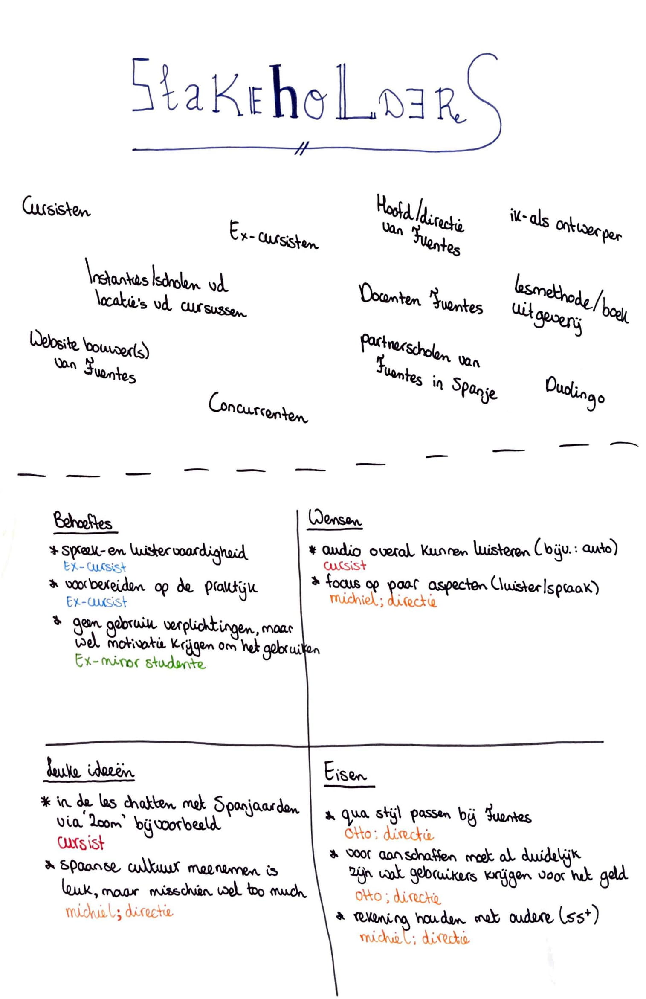

# Soorten stakeholders

Hieronder is op de bovenste helft te lezen welke stakeholders er allemaal komen kijken bij mijn project. Daaronder staan behoeftes, wensen, leuke ideeën en eisen van deze stakeholders.

Deze stakeholders heb ik ook verdeeld in een stakeholder map. Dat is hieronder te zien:



