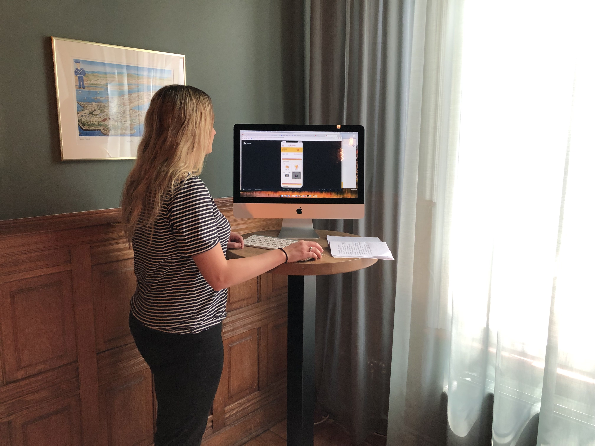

# Lorrain \(hoofdkantoor Fuentes\) - 9 mei

Lorrain is medewerkster op het hoofdkantoor van Fuentes. Zij voerde een usability test uit op 9 mei. Haar allereerste indruk was zeer positief. Ze zei: "Toen je gisteren belde dat je je app wilde testen met cursisten werd ik enthousiast en wilde ik ook graag testen.".

### Punten die uit de usability test kwamen:

* In het begin heb je het in de uitleg over het niveautest over 30 vragen. Vervolgens zeg je in de uitleg dat er maximaal 8 toetsen te doen zijn. Dit is onduidelijk.
* Meld in de uitleg dat de toets niet tussentijds op te slaan is en dat de antwoorden te niet te corrigeren zijn.
* Que -&gt; Qué
* In de uitslag van de niveautest staat: "...van de 200 punten". Dit is volgens mij een foutje.
* Zeg in het scherm met de uitslag: "Volgens de test heb jij niveau ... ". Dit is logischer dan dat je zegt dat je echt een niveau hebt, want een test is maar een moment opname natuurlijk.
* Halfgevorderde --&gt; Halfgevorderden
* Verdiend --&gt; Verdient
* De visualisatie van de balk is erg sterk. Houd dit er in!
* Wat gebeurd er als je boven de 10.000 punten komt? Ga je dan een niveau hoger? Notificatie dat je een niveau hoger kan? Of ga je terug naar 5000 punten?
* Hoe zie je hoever je in de streak met 7 dagen 10.000 punten bent?
* Laat bij de pepertjes zien dat je bijvoorbeeld op 10.600 punten zit.
* Koppel de pepertjes vast aan een week zodat iedereen bij week 11 dezelfde pepertjes ziet ook al heeft een ene gebruiker de app eerder geïnstalleerd dan een ander.
* Leg duidelijker uit bij de luister-game dat de gebruiker 1 van de 2 antwoorden moet selecteren.
* Na de laatste vraag moet er in de button staan: "Rond de test af' in plaats van "Door naar de volgende vraag"
* Zijn je pepertjes en scores terug te zien van je account op vorige niveau? Als je een betaald account hebt zou ik wel graag willen dat je het terug kan zien.
* "Direct inschrijven". Is dit voor een account of voor een cursus? Maak dit duidelijker.
* Spreek persoonlijk aan in de progressbar. Geef bijvoorbeeld een aanbevolen account aan + een link er naar toe.
* Geef een terugkoppeling na dat een gebruiker heeft gespeeld en de app af wil sluiten.

