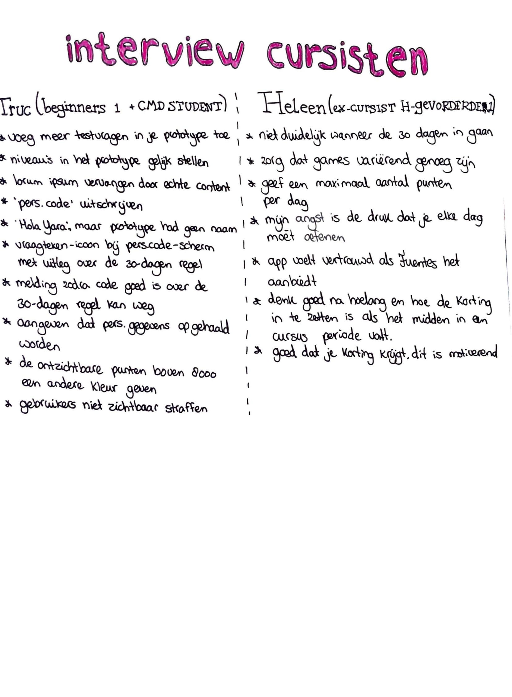

# Truc \(cursist\) - 5 april



#### Welk niveau volg je op het moment?

Truc volgt op het moment Spaans Beginners 1 \(A1.1\). Is zelf niet helemaal bekend met het ERK.

#### Hoe bevalt de cursus?

De cursus bevalt goed. Het is intensief, ik heb een leuke docent. Het pittige tempo is makkelijker als hij niet ondertussen ook aan het afstuderen was, maar als je je tijd goed plant is het goed te doen. Hij is zelf meer latertje qua maak- en doe werk.

#### Wat is de reden dat je Spaans wil leren?

Ik ben opgegroeid met een Spaanse familie. Ik wilde altijd al Spaans leren en gitaar leren spelen, maar het kwam er nooit van. Nu wilde ik langzaam aan mijn to-do lijst afmaken en besloot ik er aan te beginnen.

#### Wat doe je buiten de lessen om aan Spaans?

Ik deed eerst Duolingo, maar gedurende tijd gaan de opdrachten lastiger en verdwijnt de motivatie en kreeg ik een gebrek aan tijd. Ik ging altijd de notificaties wegschuiven. Ik heb Spaanse vrienden, maar spreek er geen Spaans mee.

#### Wat wil je erna gaan doen aan Spaans?

Ik wil graag reizen naar het zuiden naar landen waar de taal wordt gesproken. Niet nu, maar misschien later.

#### Dit is het prototype, kan jij mij vertellen wat je ziet en ervaart?

* \(ik ben nieuw\) Welkom scherm &gt; persoonlijke code, maar weet niet wat het inhoudt &gt; kiest voor nieuw, geen idee of dat moet &gt; kiest niveau &gt; start de test &gt; volgende vraag &gt; einde van de test, ik zou extra vragen er tussen gooien om testpersonen een betere context te geven, want nadat een testpersoon maar één vraag ziet krijgt die de melding ‘je hebt nog 1 vraag open staan’ &gt; daarna de test afronden &gt; Het scherm met ‘Gefeliciteerd’ is een ander niveau dan die geselecteerd was in het begin &gt; ik zou geen lorum ipsum doen bij de test, dit geeft geen context &gt; profiel aanmaken, was mij niet duidelijk, want ik deed eerst een test en daarna profiel aanmaken uit het niets &gt; zero state met profiel &gt; het overzichtscherm zegt ‘hallo yara’ terwijl die in het profiel aanmaken niet ingevuld was
* \(ik heb een pers. code\) Welkom scherm &gt; persoonlijke code &gt;  ik zou ‘pers.’ niet afkorten, maar volledig uitschrijven &gt; waarschuwing over aantal dagen dat de code nog geldig is kan hij niet veel mee &gt; ‘voer hier je code in’ &gt; ik zou een vraagteken-icoon toevoegen voor meer informatie met daarin de info ’30 dagen geldig’ &gt; melding code is correct: weet niet of de toegevoegde waarde is dat die nog 14 dagen geldig is, want je gebruikt de app dan al &gt; ik zou aangeven ‘je gegevens worden opgehaald’ in het scherm voor het overzicht

#### Uitleg concept gevolgd door feedback van Truc:

Stel ik heb 2 dagen geen tijd, dan gaan er 600 punten weg, terwijl ik echt geen tijd heb. Dit kan demotiverend zijn. Ik zal de cursisten niet straffen. Kijk goed naar ‘B = MaT’. Triggers en motivatie zijn nodig voor een bepaald gedrag, dus liever niet straffen. Onzichtbare punten zijn lastig, je ziet het niet, dus dit is lastig voor gebruikers en kan verwarrend zijn. Stel ik speel 3 spelletjes terwijl ik al 8000 punten had, dan zal ik die 300 punten erboven in een andere kleur doen. Per dag kunnen er dan wel punten af als je niet speelt, maar dan alleen van je extra gespaarde punten boven de 8000. Je kan dus nooit lager dan 8000 punten komen. Je kan dus niet spelen en alsnog verliezen alleen is dit minder zichtbaar. Ik zou als ik jou was op zoeken wat de reden is waarom mensen afhaken met taalapps. Het is belangrijk om daar op in te spelen, alleen als het toegevoegde waarde heeft. Naar triggers kijken. Je kan een melding geven met ‘we zien dat je al een poos niet speelt wil je om de week een notificatie ontvangen?’ Zo deed als het goed is Duolingo dit. Andere app vroeg welke dagen je beschikbaar was voor spelletjes om dan meldingen te sturen. Hoe ga je spreek-games uitwerken? Ik als beginner zal wel altijd voor 3 makkelijkere games kiezen dan 1 moeilijke voor veel meer punten. Ik zal de moeilijke uiteraard wel proberen, maar waarschijnlijk niet volledig halen. Laatste tip: ga aan andere vragen wat zij verwachten en begrijpen van het hoofdscherm.

#### Wat vind je sterk?

Het is interessant dat je werkt met beloningen, maar kijk wel goed naar de motivatie en triggers hiervan. Je wil natuurlijk een goede beloning, maar als ik het 2 weken gebruik en daarna nooit meer, wat haalt mij dan over om terug te komen? Wat kan ik met de punten? Ik zou korting geven bij Fuentes met een x-aantal punten. Gamemakers werden op hun vingers getikt door ludeboxes, gebruikers betalen voor box in een game, maar uitkomst is variabel, bijvoorbeeld bij elke 1000 punten krijg je een ander kado. Als je elke keer iets anders krijgt wordt je meer getriggerd. Kijk hier even naar, want dit kan op gokken lijken en dat kan strafbaar zijn.

#### Wat verwacht jij onder de pagina ‘instellingen’ en ‘geschiedenis’?

_instellingen:_ account persoonlijke gegevens, foto aanpassen, Fuentes heeft niet veel gegevens van mij nodig, misschien je meldingen kunnen instellen, zoals notificaties

_geschiedenis_: cursus overzicht

#### Ken je nog cursisten?

Ik zal eens rondvragen of zij open staan om te helpen. Mij mag je altijd nog vragen stellen!



#### Welk niveau heb je gevolgd?

Spaans halfgevorderde 1. Ze wilde graag halfgevorderde 2 volgen, maar er waren niet genoeg inschrijvingen.

#### Wanneer heb je deze afgerond?

Oktober 2018.

#### Welke vaardigheid of vaardigheden beheers je nu minder of zou je graag wat meer willen beheersen?

Spreekvaardigheid en schrijfvaardigheid beheerst ze nu minder en wil ze graag meer terug,. Luistervaardigheid is nog het beste.

#### Dit is het prototype, vertel mij wat je ziet en ervaart

\(persoonlijke code\) Pers code &gt; leest dat de 30 dagen geldig is, vraagt zich wel meteen af vanaf wanneer, het downloaden van de app of het krijgen bij de certificatie? Optie dat je code kwijt is, is duidelijk &gt; code is correct &gt; daarna verwacht zij dat haar persoonlijke gegevens correct tevoorschijn zullen komen  

\(ik ben nieuw\) Alle niveaus als overzicht, link naar info over de niveau’s. Ik denk dat je hier kan lezen wat er per niveau voor kennis vereist is. Ik lees dat de test in 1x gedaan moet worden, zal aan geven welk niveau ik heb &gt; Ik zie dat ik de test snel gemaakt heb &gt; Geeft aan dat ik een vraag over heb en dat ik deze kan afmaken of de test afronden &gt; ik heb het niveau behaald en kan de antwoorden terug zien &gt; neem aan dat het profiel aan maken dan ook 30 dagen geldig is

#### **Uitleg concept gevolgd door feedback**

Je wil zien dat je vooruit gaat en daarom is zo’n progressbar motiverend. De extra punten in een extra balkje lijken mij erg nuttig. Zorg voor genoeg variatie in games, zodat het uitdagend blijft. Zijn de games oneindig te spelen? Misschien een maximaal aantal punten per dag weg geven? Hoe oneindig is deze app in totaal? Ik heb zelf het werboek gemaakt tijdens de cursussen, toen was het boek uit en tja en toen? Ik blijf nu wel op mijn eigen manier oefenen met Spaanse podcasts en muziek. Het spreken verleerd snel. Ik zou het concept gebruiken, want het sluit aan op de plezierige cursussen. Als het vanuit Fuentes wordt aangeboden en je kent de vertrouwde cursussen dan neem je dit sneller aan. Mijn angst is dat de druk van dat je elke dag ermee bezig moeten zijn mij tegen zou houden. Zorg hier voor een goede balans in. Ik ben iemand die niet te veel met mijn telefoon bezig wil zijn en niet een app wil gebruiken die dat nog erger maakt. Je onderhoudt je kennis dat is goed en je krijgt korting wat je extra motiveert. Stel je hebt B1 afgerond en dan krijg je voor 30 dagen een code en na 30 dagen heb je genoeg punten voor korting en die wil je dan inzetten dan zit je midden in een cursus proces. Hoe kan je dan die korting toepassen? Is dit later inzetbaar? Zo ja, hoelang nog?  Fijn dat alles in fuentes stijl is, duidelijk opgedeeld in duidelijke vakken, alles is overzichtelijk. Een algemene progressbar in de onboarding kan afschrikken, lijkt dat het dan heel lang gaat worden, staat bij dat het profiel aanmaken maar 30 seconde duurt dus dat is kort genoeg, maar kan voorstellen dat het bij de algehele stijl wel past omdat er meerdere bars worden gebruikt. 

#### Wat voor functie’s verwacht je dat er onder het menu staan?

Uitleg over de app en dat ik mij af kan melden, de voorwaarden van de app met achtergrond informatie, hoe lang mijn code nog geldig is, onder welke naam ik ingelogd ben, mijn profiel, contact gegevens van Fuentes en een link om in te schrijven voor een vervolgcursus.

#### Wat verwacht je onder een ‘instellingen’ en ‘geschiedenis’ pagina?

_instellingen:_ geluid instellingen, misschien ook of je wel of niet met de groene balk wil werken, hoe de weergave van de app eruit ziet

_geschiedenis:_ wanneer je bent begonnen, welke dag en week. Je voortgang in spelletjes en die misschien onderscheiden in spreek- en luistervaardigheid.



