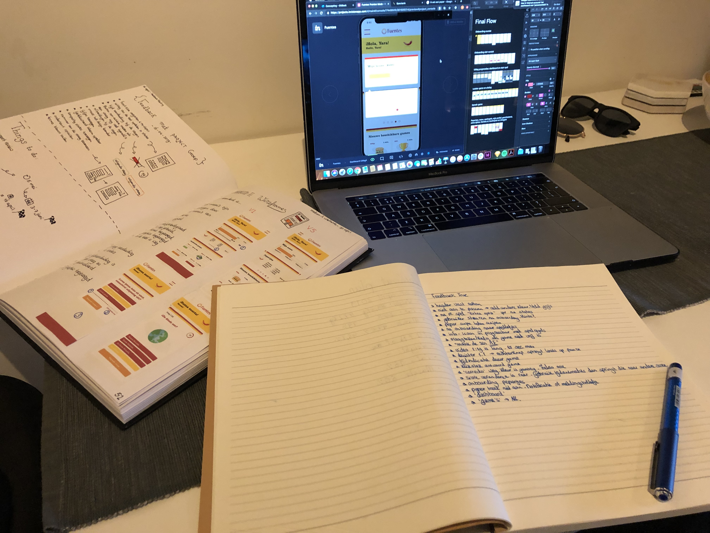

# Truc \(ex-cursist\) - 7 mei

Dinsdag 7 mei voerde ik een Usability test uit met Truc. Truc heeft in maart en april 2019 een cursus gevolgd bij Fuentes. Ook is hij momenteel aan het afstuderen bij CMD aan de HvA. Hierdoor leek het mij perfect om hem te gebruiken voor een usability test zodat hij feedback kon geven vanuit een CMD-oogpunt.

Gekregen feedback:

* Ik zou in het prototype je header vast zetten. Dit ziet er strakker uit en is gebruiksvriendelijk, want zo is je header altijd in beeld. Ook op lange scrollpagina's.
* In het 'profiel aanvullen'-scherm staat: "Niet aan te passen". Ik zou deze inputveld veranderen in een andere backgroundcolor zodat er onderscheid is met de inputvelden die wel te veranderen zijn. Ik zou de background grijs maken.
* Ik zou na de onboarding de gebruiker sturen wat je wil dat hij gaat doen. Nu is het zoekende wat ik kan en moet doen. Gebruik andere animerende tips.
* Ik zou het peperveld echt daadwerkelijk laten swipen om dit beter te laten uitstralen.
* Stuur gebruikers na de onboarding meteen door naar de games.
* Plaats een info-icoon in de progressbar waar de spelregels te vinden zijn.
* Vervang de nog-niet-vrije-games in een vraagteken of een kado. Dit triggert de gebruikers om een game vrij te spelen.
* "Maak de zin." moet zijn --&gt; "Maak de zin AF.".
* Je video in de game duurt 1:19 en dit is erg lang, maak het korter of haal dit scherm weg. Maak de video's maximaal 15 seconde.
* In luister game 1.1-scherm springt het linkerblok op pauze als je op het rechterblok klikt.
* Geef de games een tijdindicatie mee in de balk of bij de balk. Maak de games ook niet te lang.
* Maak in het prototype bij de vragen 1 groot vlak als klikvlak.
* Haal 'correcto' en 'falso' weg, want de kleur zegt al genoeg.
* Het is raar dat in het prototype gebruikers de score kunnen laten veranderen. Doe dit door middel van tijdsindicatie.
* Onboarding geven aan/over de pepertjes.
* Pepertjes trekken niet aan. Maak notificaties en verwijs naar het menu met 'pepertjes overzicht' of gebruik meldingsbolletjes.
* 'Dashboard' is geen aantrekkelijke naam.
* Je gebruikt soms Nederlandse woorden en soms Engels.
* Gebruik Spectacle. 

