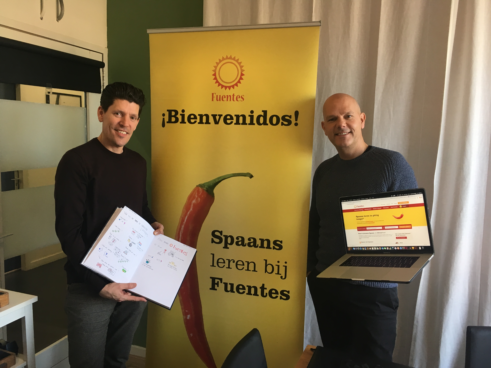
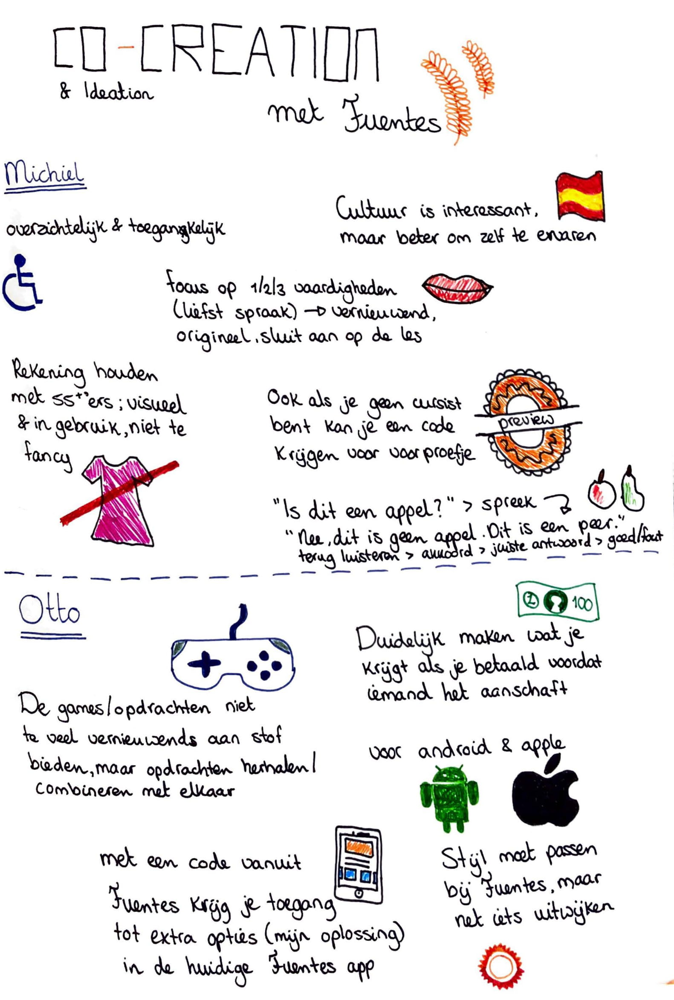

# Co-creation met hoofd van Fuentes

Ik vertelde Otto en Michiel wat ik allemaal had ondervonden tijdens mijn onderzoeken. Vervolgens liet ik hen hardop nadenken over ideeën voor een digitale oplossing. Hieronder is te zien wat eruit kwam.



* Overzichtelijk en toegankelijk
* Geen verzameling van alle vaardigheden \(luister-, spreek-, schrijf-, leesvaardigheden etcetera\)
* Focus op spreekvaardigheid, dit is vernieuwend, origineel en een goede aanvulling op de les
* Cursisten kunnen zelf al veel boekjes kopen en oefenen met vocabulaire en grammatica. -
* Spaanse cultuur is interessant, maar voor een app niet geschikt. Er zijn zoveel culturen binnen het Spaans. Dit moeten ze ervaren in plaats van leren in een app. 
* Rekening houden met oudere leeftijd, makkelijk in gebruik en visueel. Niet te fancy en alleen voor het jonge publiek, maar ook voor ouderen, want zij hebben meer tijd. Visueel ook aangetrokken worden voor oudere mensen. 
* Ook als je geen cursist bent kan je een code krijgen om sfeer te proeven van Fuentes en geïnteresseerd te raken.
* App met video’s en audio’s. 
* Gratis versie met wat beperkingen. Betalen geeft meer opties en je raakt geïnteresseerd in een vervolgcursus.
* Stijl wordt anders, misschien niet meer zo knal geel en rood, wat menselijker maken. 
* Ook op een tablet makkelijk moeten kunnen vinden en gebruiken

\*\*\*\*



* Stof en spelletjes niet te veel vernieuwend, opdrachten herhalen / samenvoegen. 
* Duidelijk maken wat je ervoor krijgt als je betaald, eerlijk in het begin aan duidelijk maken waarvoor je wel of niet moet betalen. 
* Fuentes app in gaat \(mijn oplossing in gekoppeld is\), als je code in vult dat je dan naar een extra optie is. 
* Qua stijl wel passen bij Fuentes maar net iets anders. 
* Voor Android en apple, alles moet toegankelijk zijn.



Hieronder is te lezen wat Michiel & Otto als ingevingen hadden. Ook stelden we een lijst met Programma van Eisen op. Die is hier te vinden:



