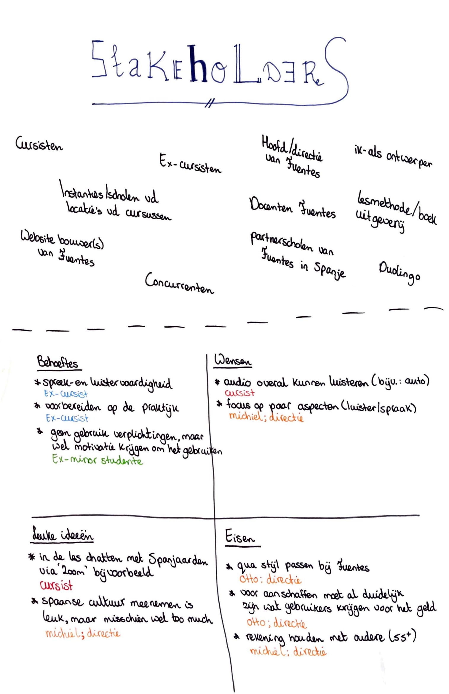
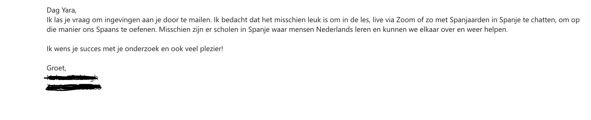
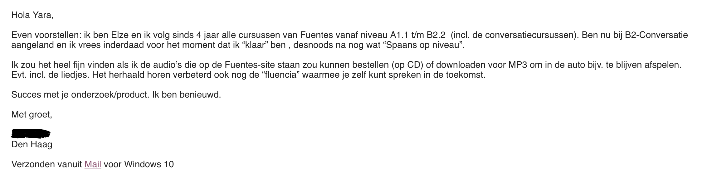

# Soorten stakeholders

Hieronder is op de bovenste helft te lezen welke stakeholders er allemaal komen kijken bij mijn project. Daaronder staan behoeftes, wensen, leuke ideeën en eisen van deze stakeholders.

Deze stakeholders heb ik ook verdeeld in een stakeholder map. Dat is hieronder te zien:



#### Alle stakeholders:

* Cursisten van Fuentes
* Ex-cursisten van Fuentes
* Instanties/scholen waar Fuentes de lokalen huurt voor de cursussen
* Concurrenten, zoals: Molinos de Viento, Education First en LOI
* Partnerscholen van Fuentes in Spanje
* Duolingo en andere taalapplicaties
* Lesmethode- en boek uitgeverij
* Hoofd/directie van Fuentes
* Docenten van Fuentes
* Website bouwer\(s\) van Fuentes
* ik zelf, als ontwerper



* Spreek- en luistervaardigheid \(behoefte van: ex-cursisten\)
* Voorbereiden op de praktijd \(behoefte van: \(ex-\)cursisten\)
* Geen gebruik-verplichtingen, maar wel motivatie krijgen om het te gebruiken \(behoefte van: \(ex-\)cursisten en minor Spaans studenten\)



* Overal Spaanse audio kunnen beluisteren om zo je Spaans te oefenen en verbeteren. Bijvoorbeeld in de auto in plaats van de radio aan zetten luisteren naar Spaanse podcasts \(wens van: ex-cursist\)
* Focus op een paar vaardigheden in de digitale oplossing en niet alle vaardigheden \(spreek-, luister-, lees-, schrijfvaardigheid\) \(wens van: het hoofd van Fuentes\)



* in de Spaanse les een live chat doen met Spanjaarden via het programma Zoom \(idee van: cursist\)
* Spaanse cultuur meenemen is leuk om zo wat meer van de praktijk mee te krijgen, maar dit kan er wel voor zorgen dat het zwitsers zakmes wordt met te veel functie's \(idee van: het hoofd van Fuentes\)



* De digitale oplossing moet qua stijl passen bij Fuentes. Het mag hier en daar een eigen stijl krijgen dat niet terug te zien is op de website. Zolang het in één oogopslag duidelijk is dat het van Fuentes is \(eis van: het hoofd van Fuentes\)
* Voor het aanschaffen of betalen van de digitale oplossing moet het al duidelijk zijn wat gebruikers krijgen \(voor het geld\) \(eis van: Fuentes\)
* Houd rekening met onze volledige doelgroep. We hebben ook veel cursisten van 55+, dus maak geen digitale oplossing met moeilijke gestures en moderne buttons of andere ingewikkelde dingen \(eis van: Fuentes\)





