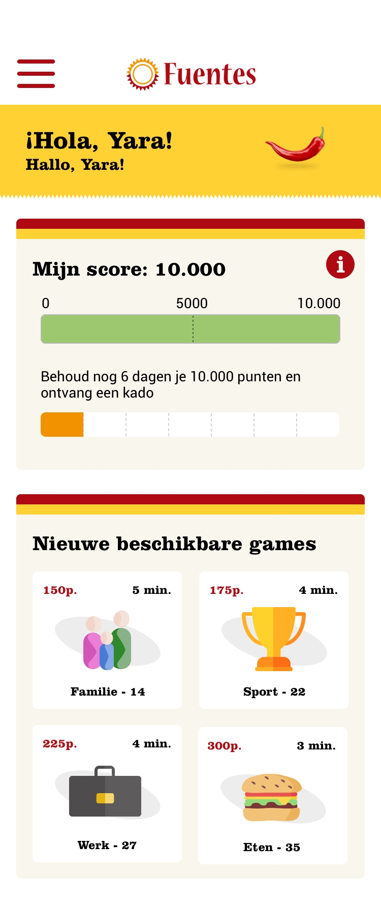
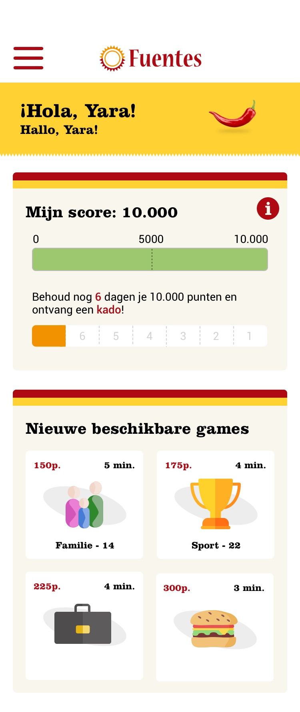
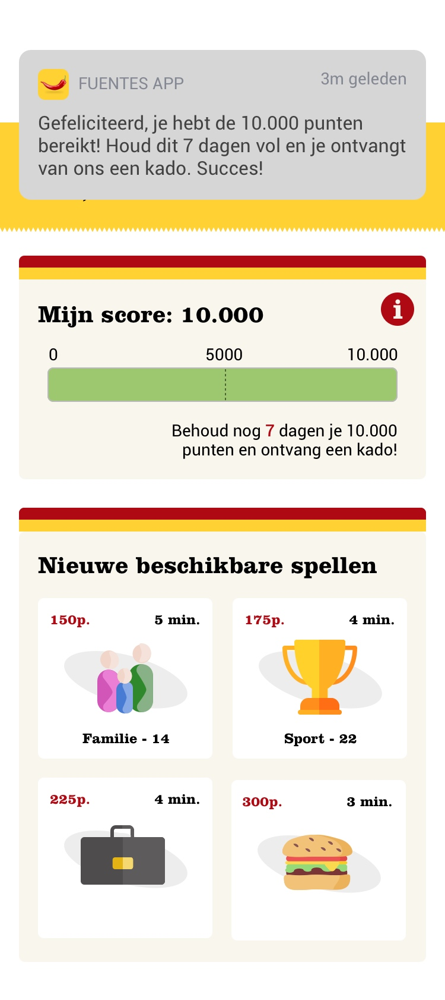
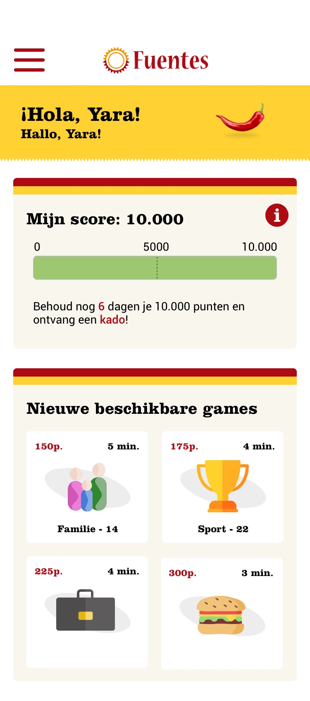
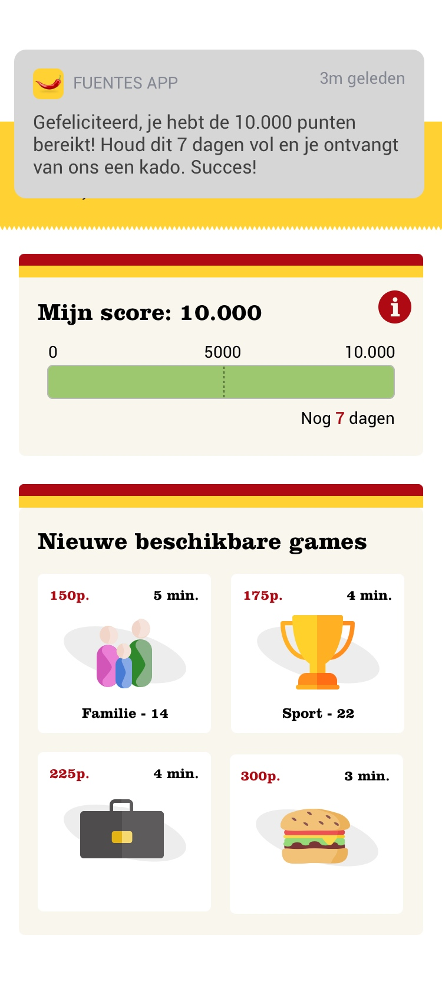

# A/B Testing - 14 mei

Hieronder zijn 5 versies te zien hoe ik aan de gebruikers duidelijk wil maken dat zodra zij 7 dagen lang hun score op 10.000 punten weten te behouden dat zij dan een kado ontvangen. Dit heb ik op 5 verschillende manieren uitgewerkt. Mijn A/B testing is dus meer een A/B/C/D/E testing geworden.

Ik testte met Helen \(ex-studente van minor Spaanse Taal & Cultuur\) mijn prototype die op dat moment af was. Daarnaast testte ik ook deze 5 onderstaande schermen.

Haar feedback hierop was:

* Ik vind een visuele balk erbij met hoeveel dagen je nog moet erg duidelijk. Wel maakt dat het een beetje vol. Er is dan veel te zien en dan zijn twee balken wel verwarrend.
* Een notificatie vind ik erg sterk. Zelf lees ik notificaties van apps wel. Ik kan begrijpen dat andere gebruikers dit niet gaan lezen. Dan is het wel sterk om er alsnog terug te kunnen zien wat de bedoeling is.
* De test met alleen 'nog 7 dagen' na een uitgebreide notificatie is niet duidelijk. 

