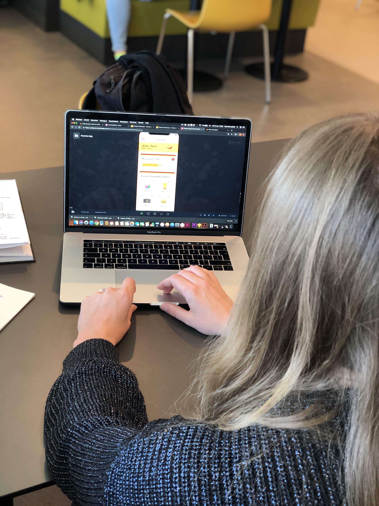

# Helen \(Minor\) - 14 mei

Dinsdag 14 mei hield ik een usability test met Helen. Zij volgde net zoals ik de minor Spaanse Taal & Cultuur in 2018. Zij zit nu in de fase waarin zij ongeveer een jaar geleden haar laatste Spaans lessen heeft afgerond en nu is zij de taal aan het verleren. Zij omschrijft dit zelf als: "Ik heb nu te weinig oefen materiaal en weinig mensen om mij heen spreken de taal om met hen te oefenen.". Ik voerde met haar een usability test uit. Hieruit kwamen de volgende punten:

* In het profiel-scherm is de 'opslaan' button uit het zicht. Hierdoor is deze lastig te vinden.
* In de uitleg van de progressbar wordt er gezegd: '.. je ontvangt kado's.'. Wat zijn deze kado's?
* Is de stof in de app een aansluiting op wat er in de cursus is behandeld? 
* Het is leuk dat je je richt op luister- en spreekvaardigheden.
* Ik zou een spel wel uitleg geven als een gebruiker het voor het eerst wil spelen, maar geef deze uitleg dan niet meteen na de uitleg van de progressbar. Dan wordt alle informatie te overweldigend. Geef deze informatie pas als een gebruiker op een spel klikt.
* Het is leuk als de luistergame-video's samen een 'serie' vormen. Dat een vraag een vervolg is op de vraag/video ervoor.
* Na de uitleg van de progressbar zou ik wel een kleine rondleiding aanbieden, maar dat deze wel over te slaan is voor degene die dit niet willen.
* Ik denk dat de games die een slotje hebben inhouden dat je óf \(nog\) niet betaald hebt waardoor je het niet kunt spelen óf of dat je nog niet op dat level bent om het te kunnen spelen.

