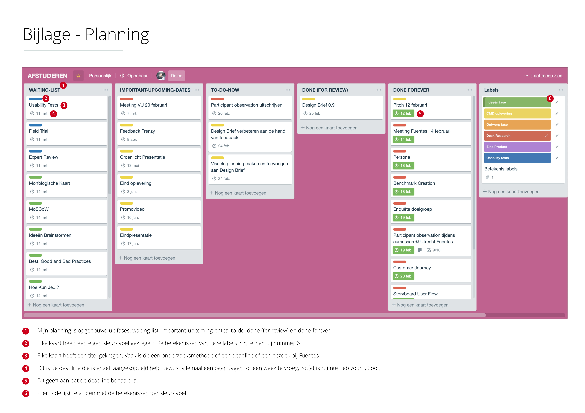
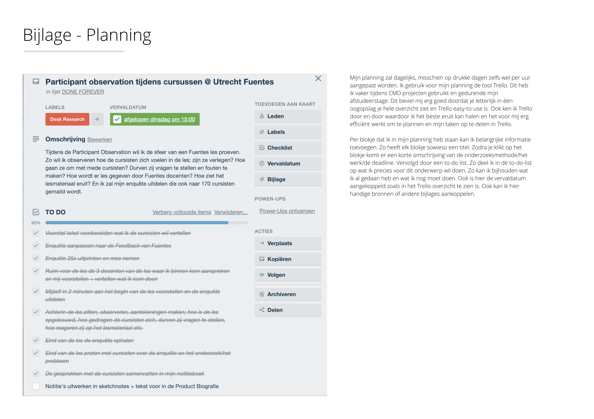

# Planning

### Hier is mijn planning te zien die ik vooraf aan de vijf maanden had gemaakt.

Hier is mijn dashboard te vinden waarin ik alle taken onderverdeelde. Dankzij mijn Trello board had ik altijd een duidelijk overzicht met wat ik al had gedaan en wat ik nog moest of wilde doen.

### TO-DO lijst vrijdag 10 mei

#### Wireframes aanpassen

* [x] Inputveld 'behaalde niveau' andere background-color geven zodat het duidelijk is dat deze niet aan te passen is
* [x] Geef niet meteen de optie dat er extra mogelijkheden tot betaalde accounts zijn. Doe dit pas na het eerste spel.
* [x] Na de progress-onboarding een onboarding over de games.
* [x] Info-icoon in de progressbar met uitleg over de puntentelling
* [x] Spellen die nog geblokkeerd zijn een vraagteken/slotje/kado als afbeelding geven
* [x] Video in de luister-games korter maken
* [x] Tijdsindicatie van de hoelang de game nog duurt mee geven
* [x] Haal 'correcto' en 'falso'  weg in de button zodra een gebruiker het antwoord controleerd. Alleen de kleur van de button en de omlijning van het antwoord zegt al genoeg
* [x] Geef notificatie wanneer er een nieuw pepertje binnen komt en haal het weg uit het dashboard
* [x] Verander de naam 'dashboard' en maak alles Nederlands
* [x] Werk uit wat er gebeurd als iemand een game afsluit
* [x] Stuur gebruikers in de manier hoe zij antwoord moeten geven bij de spreekgames
* [ ] Maak het menu contra/goed na denken over hoe alles samenloopt met Fuentes.nl
* [x] Toon aan bij game-overzicht hoe ver je in een spel bent en wat je nog kan hervatten
* [x] Na een week een notificatie om een spel verder te kunnen spelen
* [x] In de niveautest uitleg staat 30 vragen, maar zijn maximaal 8 toetsen te maken. Dit is nog onduidelijk en moet duidelijker omschreven worden
* [x] Melden in de niveautest uitleg dat een vraag niet te corrigeren is
* [x] "van de 200 punten" weg halen
* [x] Draai de uitlegvolgorde van de progressbar om. Begin met 600 punten per dag te verdienen en leg als laatste pas de 10.000+ regels uit
* [x] Streak toevoegen aan de progressbar

