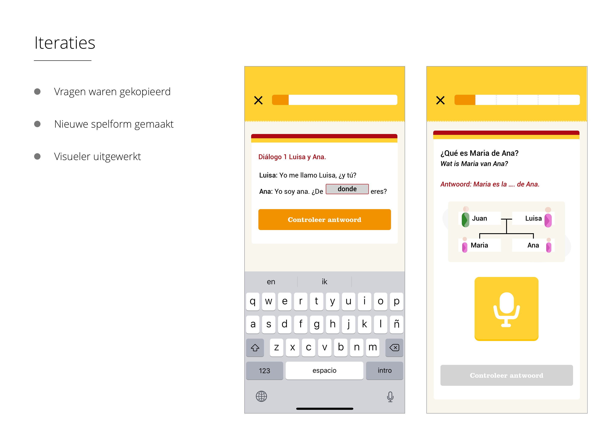
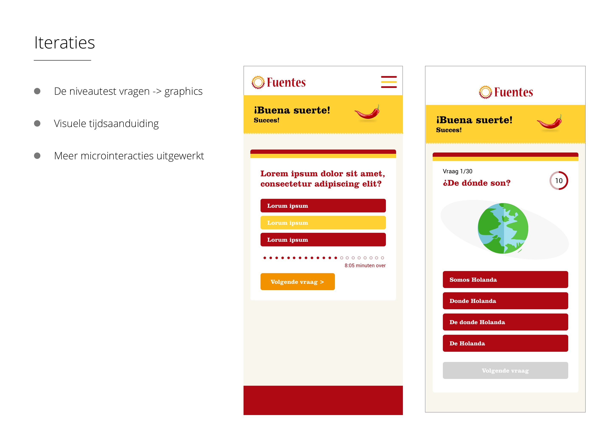
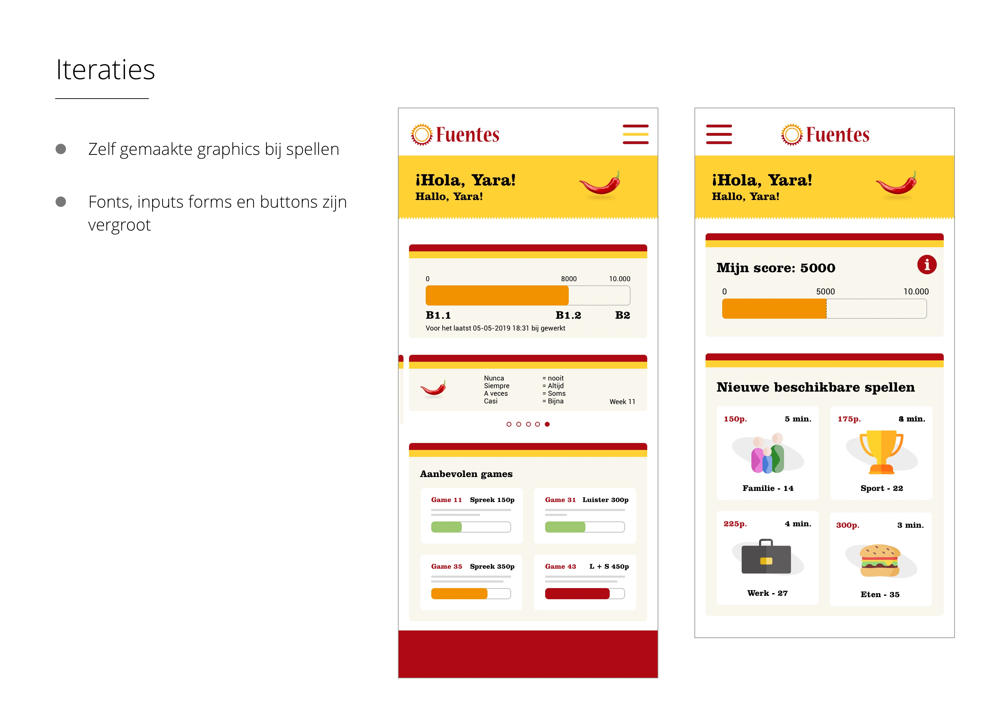

# Iteraties

Hieronder zijn twee scans te vinden uit mijn logboek waarin te zien is wat de grootste verschillen tussen mijn digitale wireframes V1 en V5 zijn. Daaronder zijn drie dia's uit mijn groenlichtpresentatie te zien waarin ik ook grote verschillen benoem tussen oude en nieuwere versies.

