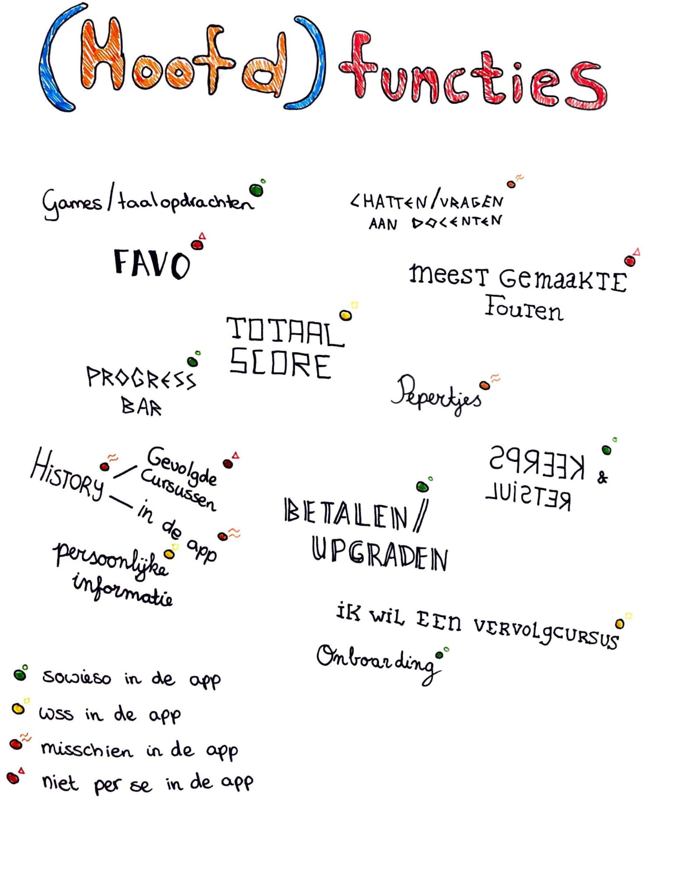

# \(hoofd\)functies

Alle features die ik ondervonden had voor in mijn app heb ik hieronder opgedeeld in vier categorieën. In: sowieso in de app, waarschijnlijk in de app, misschien in de app en niet per se in de app. Hierdoor creeërde ik voor mijzelf een beeld welke features ik nog verder moest onderzoeken of die in mijn app zouden komen ja of nee en welke niet.

