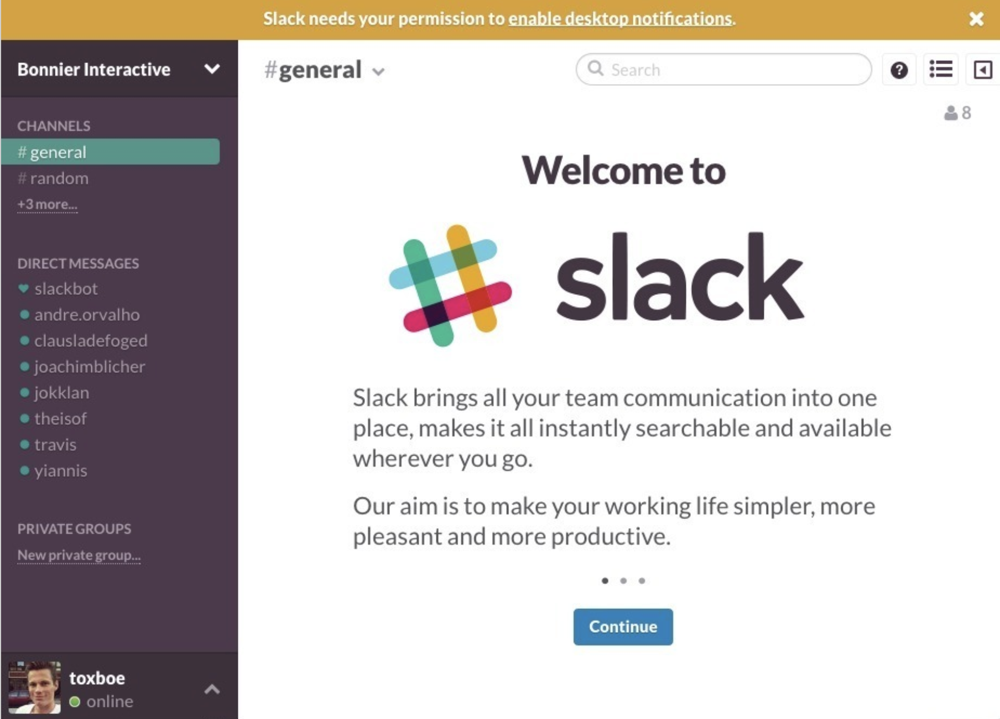
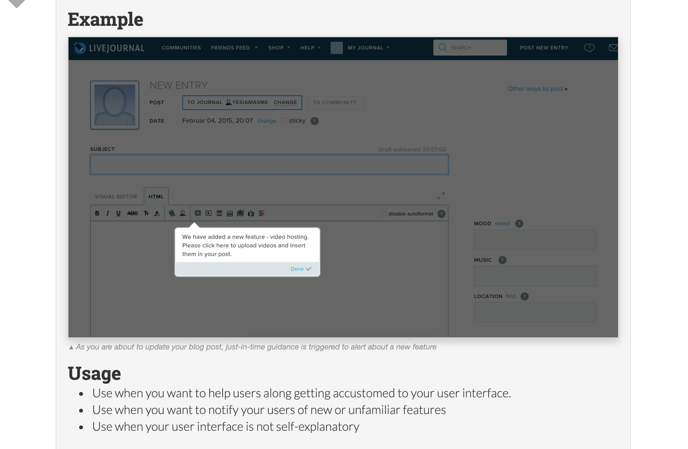
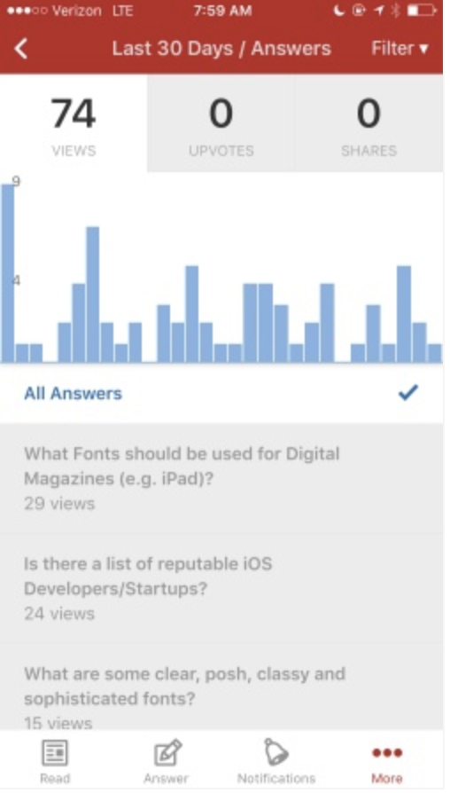
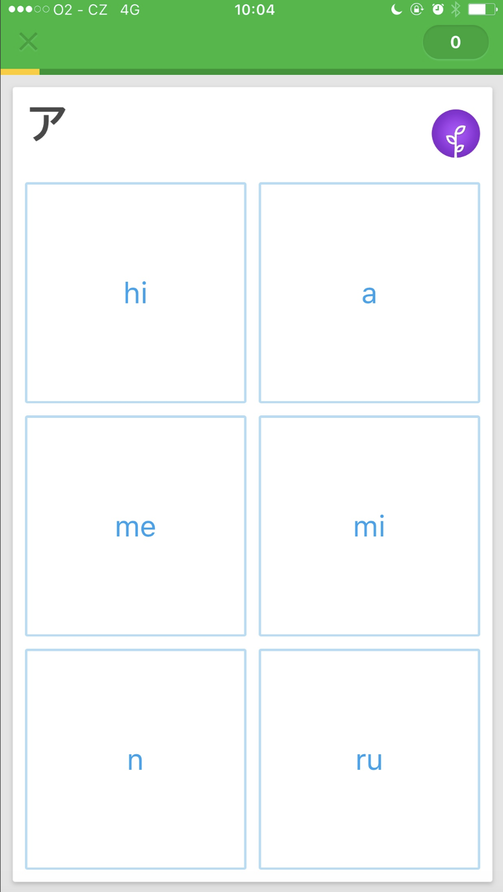
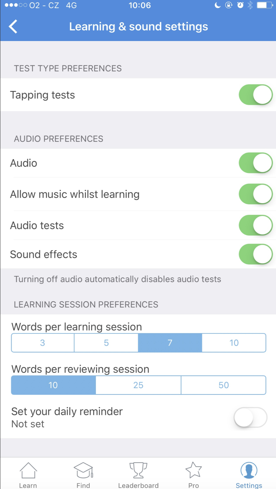
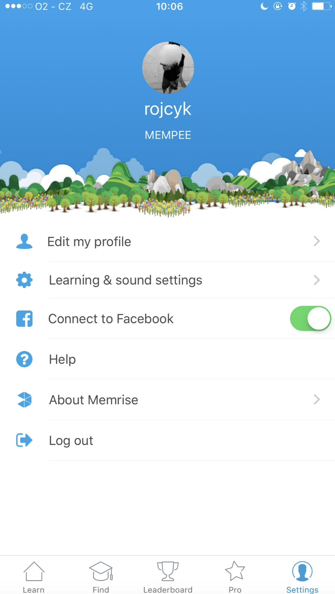
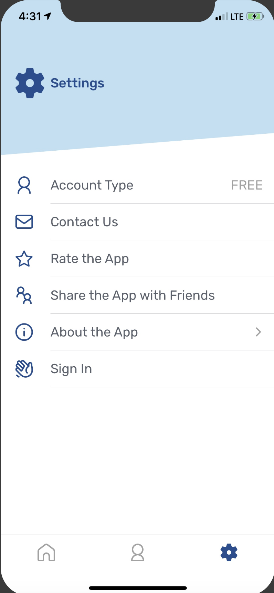
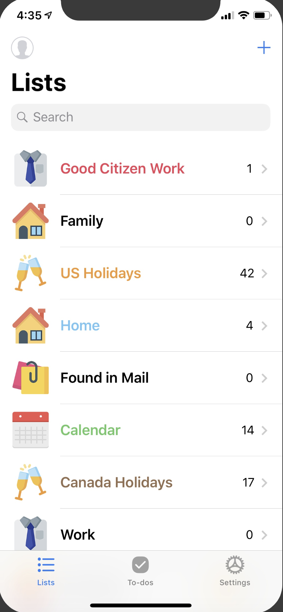
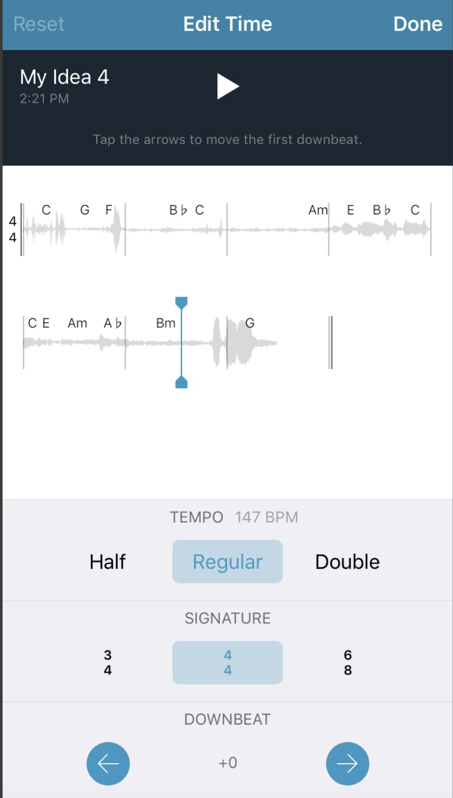
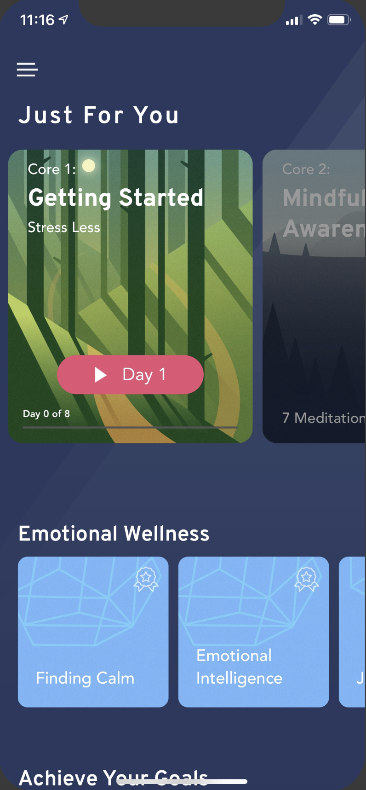

# Onboarding, Profiel, Instellingen, Menu, Audio opnemen & Progress weergeven

Hier zijn verschillende screenshots te zien van websites die ik heb vergeleken om te kijken hoe bestaande platformen/websites een onboarding tonen. Zo keek ik naar hoe zij de stappen opdelen, hoe ze visueel te werk gaan en hoe de flow werkt. Ook vergeleek ik profielen. 

#### Onboarding

#### Progress weergeven

#### Taaloefening

#### Instellingen

#### Geschiedenis

#### Menu

### Audio opnemen

#### Dashboard

