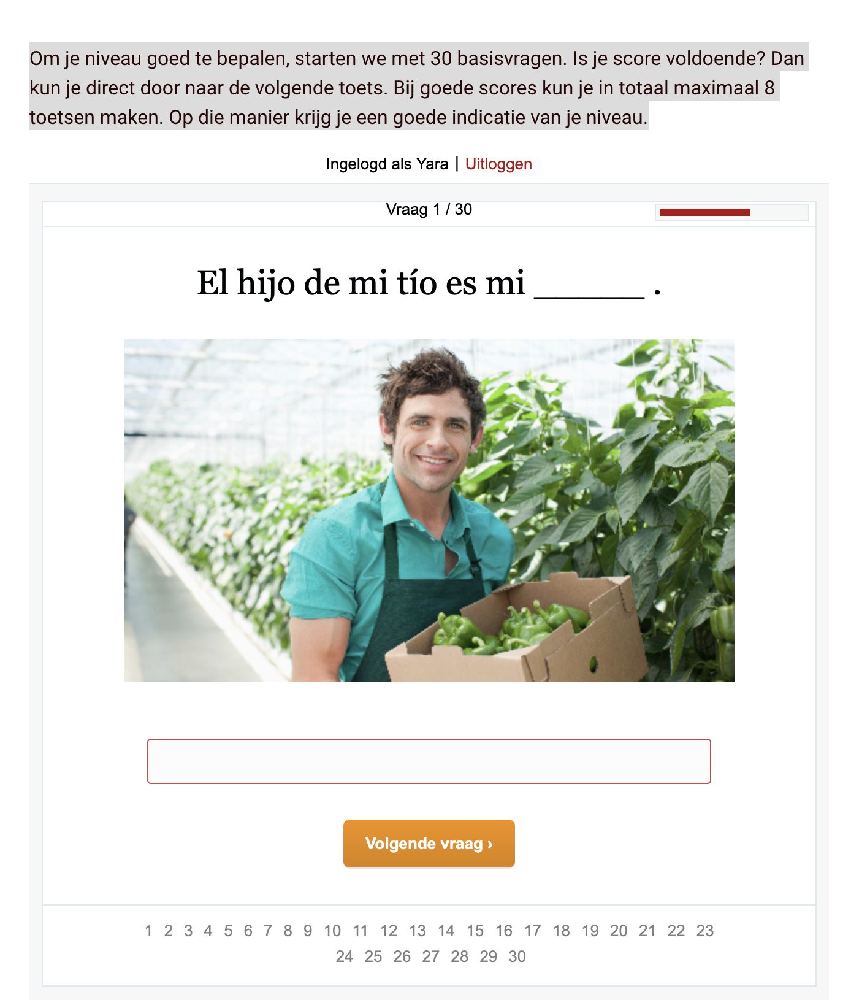
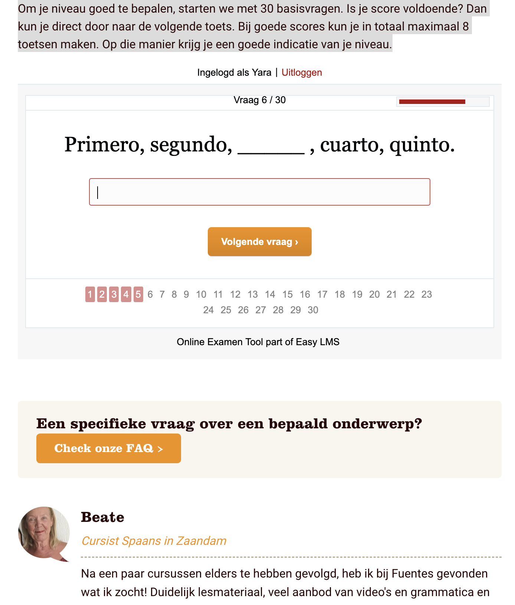
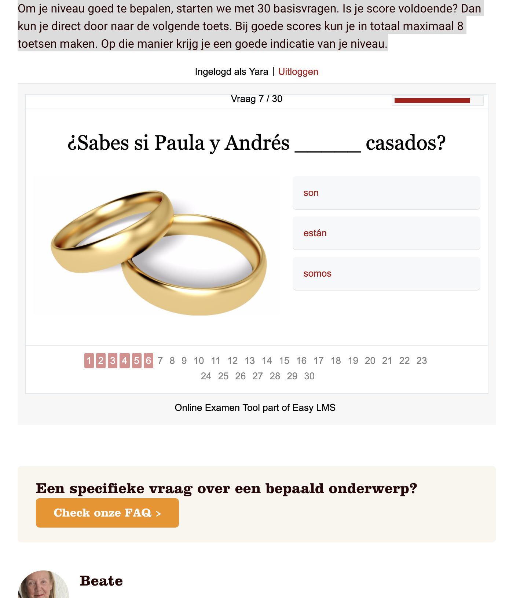

# Fuentes Niveautest

Hier keek ik hoe de huidige niveautest van Fuentes werkt. Hoe zij de tijdsaanduiding doen, hoe ze de aantal vragen tonen en hoe de vragen eruit zien. 

* Rechts bovenaan wordt er door een visuele rode balk laten zien hoeveel seconde de gebruiker per vraag nog heeft.
* De vraagaanduiding staat bovenaan door middel van: Vraag x/30
* Elke vraag heeft een afbeelding
* De manier van vragen variëren tussen open vragen en meerkeuzevragen
* Onderaan is nogmaals te zien hoeveel vragen je al hebt gedaan en hoeveel je er nog moet \(dit is dubbel met de vraagaanduiding die bovenaan staat\)

