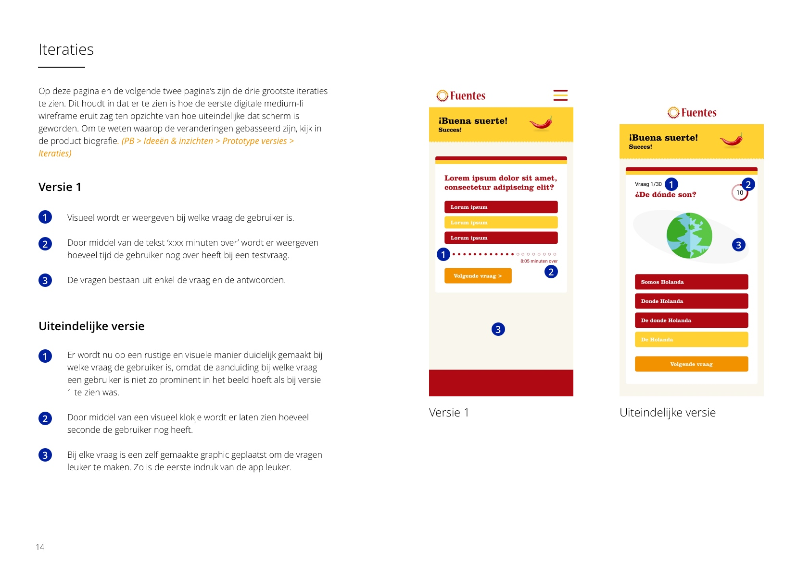
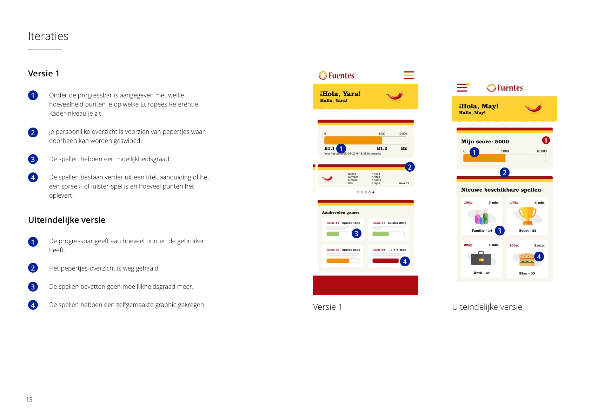
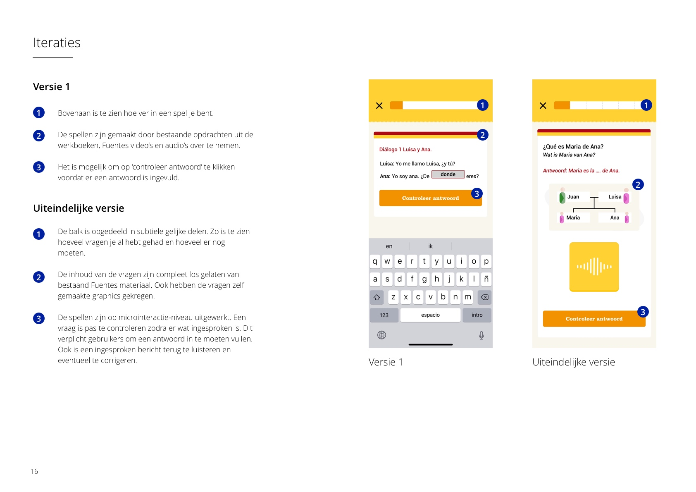

# Iteraties

Hieronder zijn twee scans te vinden uit mijn logboek waarin te zien is wat de grootste verschillen tussen mijn digitale wireframes V1 en V5 zijn. Daaronder zijn drie dia's uit mijn groenlichtpresentatie te zien waarin ik ook grote verschillen benoem tussen oude en nieuwere versies.

| V1 | V5 |
| :--- | :--- |
| De progressbar is voorzien van labels. Deze labels duiden aan op welk ERK-niveau \(Europees Referentie Kader\) de gebruiker zit.  | In versie 5 zijn de ERK-niveau's vervangen door de bekende niveau benaming van Fuentes. Het ERK-systeem is lang niet voor iedereen duidelijk en de niveau's van Fuentes wel. Daarom is dit veranderd om meer duidelijkheid te geven. |
| De font-size was 10px voor alle tekst. | De font-size is vergroot doordat ik er achter kwam dat het op mobiel best slecht te lezen was. Vooral omdat ook 55+'ers het goed moeten kunnen lezen. De font-size is nu 14px. |
| Per spel was er te zien wat de moeilijkheidsgraad is. | Per spel is er nu te zien welk thema het heeft, welk nummer van het thema het is, hoeveel minuten het gemiddeld duurt en hoeveel punten je er maximaal mee kan verdienen. De reden dat je niet meer kan zien wat de moeilijkheidsgraad is is dat alle spellen die je speelt op je bijbehorende Spaans niveau is, dus er kan geen spel moeilijker of makkelijker zijn. |
| Per vraag is er door een rij bolletjes te zien bij welke vraag je bent door middel van ingekleurde bolletjes of lege bolletjes. | De vraagaanduiding is door een subtiele kleine tekst die zegt: Vraag x/30. |
| De tijdsaanduiding die je in totaal voor de hele test hebt is als volgt: x:xx minuten over. | De tijdsaanduiding die je per vraag hebt zijn 20 seconde. Dit is in een visuele aftellende cirkel te zien. De reden dat er geen totaaltijd voor de hele test meer is, maar per vraag, is doordat de niveautest op de website van Fuentes ook zo werkt. |
| De vragen bestaan enkel uit een vraag en meerkeuze antwoorden. | De vragen bestaan uit de vraag, een zelf ontworpen graphic die bij de vraag aansluit en meerkeuze antwoorden. |
| Bij sommige input-velden staat: "\*verplicht". Dit houdt in dat gebruikers verplicht zijn om dat veld in te vullen. | De '\*verplicht' is vervangen door de niet-verplichten velden een "\[optioneel\]" te geven. Dit komt minder over alsof de gebruikers worden verplicht om dingen te doen. Dit is dan laagdrempeliger. |
| Fonts zijn 10px en input-forms zijn 32px hoog. | Fonts zijn 14px en input-forms zijn 40px hoog. |
| Er is een optie om een profielfoto toe te voegen. | De optie om een profielfoto toe te voegen is weg gehaald. Er wordt verder niks gedaan met een profielfoto, dus dit is anders een verwarrende optie. |
| De uitleg over hoe een niveautest werkt is in één scherm te zien. | De uitleg is opgebroken in vier schermen. Zo maakt het lezen van de uitleg makkelijker en leuker.  |
| De test is in hetzelfde scherm te starten. | Er verschijnt pas een button met "door naar de test" zodat de vierde uitleg in beeld komt. Dit is om te voorkomen dat gebruikers belangrijke informatie missen. |

#### Toelichting op de verschillen tussen beide versies van de drie bovenstaande afbeeldingen:

