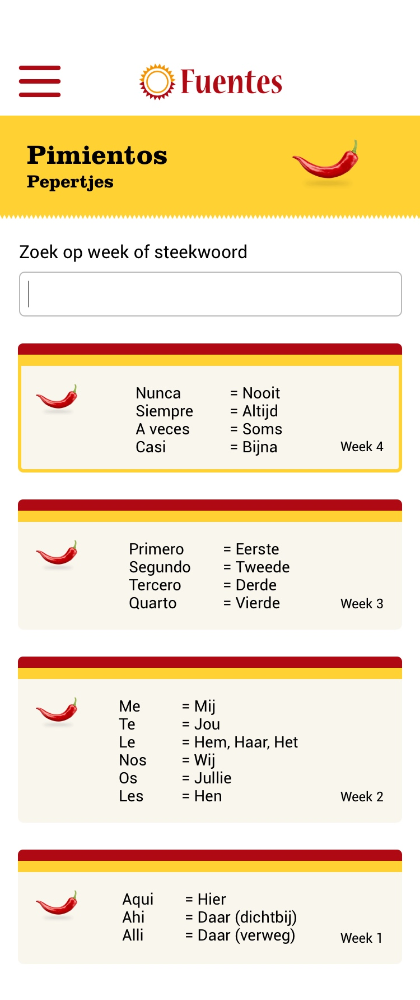

# Gekozen concept

**Voor wie wordt het concept?**

De digitale oplossing is voor cursisten van Fuentes en alle andere geïnteresseerden die Nederlands zijn en Spaans hebben geleerd en hun Spaans op niveau willen houden, zie afbeelding 1.

**Wat kunnen gebruikers doen met het concept?**

De app biedt spreek- en luister taalspellen aan. Per spel is er in de app te zien hoelang een spel gemiddeld duurt, hoeveel punten het spel maximaal op kan leveren en welk thema het spel heeft. Zodra een gebruiker voor het eerst de app gebruikt, krijgt hij/zij 5000 punten cadeau. Alle spellen zijn op het niveau dat de gebruiker beheerst. Dit wordt gecontroleerd op de volgende manieren:

- Cursisten van Fuentes ontvangen een persoonlijke code zodra zij hun certificaat aan het einde van een cursus ontvangen. De code is 30 dagen geldig om te voorkomen dat gebruikers de code pas na een lange tijd gebruiken en vervolgens vele kennis van het laatst behaalde niveau verloren zijn, zie afbeelding 2.

- Gebruikers die \(nog\) niet een cursist zijn of cursisten die na 30 dagen de code willen gebruiken moeten een niveautest doen om te kijken welk niveau zij beheersen, zie afbeelding 3.

De punten zijn essentieël en werken motiverend in de app. Uiteindelijk wordt een cursisten met genoeg punten beloond. Uiteraard moet de app er ook voor zorgen dat gebruikers regelmatig oefenen. Daarom zijn er een aantal regels wat betreft de puntentelling. 

**De regels betreft de puntentelling \(zie afbeelding 4\):**

* Per 5 dagen dat er niet geoefend wordt, verlies je 300 punten.
* Per 24 uur zijn er maximaal 600 punten te verdienen.
* Er zijn maximaal 10.000 punten in totaal te verdienen.
* Bij minimaal 7 dagen lang 10.000 punten te hebben, verdient de gebruiker een beloning. Dit is elke keer een andere beloning om het spannend te houden voor de gebruikers. De beloningen zullen kortingen zijn op een betaald abonnement in de app of andere kortingen. Hierover wordt verder op meer toegelicht.
* Niet-leden van Fuentes mogen de eerste twee weken gratis gebruik maken van de app.
* Er is van te voren te zien hoelang een spel duurt.

**Wat zijn de kosten van de app \(zie afbeelding 5\)?**

* Cursisten van Fuentes krijgen gratis toegang tot de app met hun persoonlijke code. Deze code geeft hen een gratis ‘Fuentes Basis’-account. Zodra zij een upgrade willen kost dit maandelijks een klein bedrag. Een ‘Fuentes Extra’-account kost 3,99 euro per maand en een ‘Fuentes Plus’-account kost 6,99 euro per maand. 
* Niet-cursisten kunnen de eerste twee weken gratis gebruik maken van de applicatie. Daarna kost het hen 3,99 euro per maand voor een ‘Fuentes -Basis’-account, 5,99 euro voor een ‘Fuentes-Extra’-account en 8,99 voor een ‘Fuentes-Plus’-account. 

**Wat biedt de app nog meer?** 

Behalve de spreek- en luister spellen bevat de app meer mogelijkheden, namelijk:

* Een direct link om je te kunnen inschrijven voor een \(vervolg\)cursus \(zie afbeelding 6\).
* Je geschiedenis terug bekijken. Dit houdt in de geschiedenis van de spelletjes die je gespeeld hebt en de eventuele cursussen die je gevolgd hebt \(zie afbeelding 7\).
* Elke week een ‘pepertje’ en een optie om een overzicht te zien met alle pepertjes \(zie afbeelding 8\).
* Een link naar de website en je account van Fuentes \(zie afbeelding 6\).



