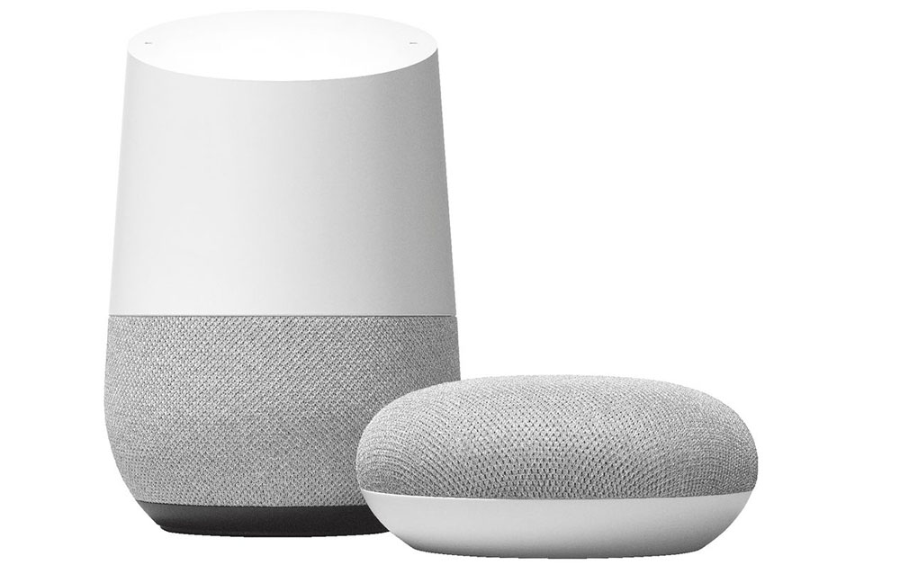
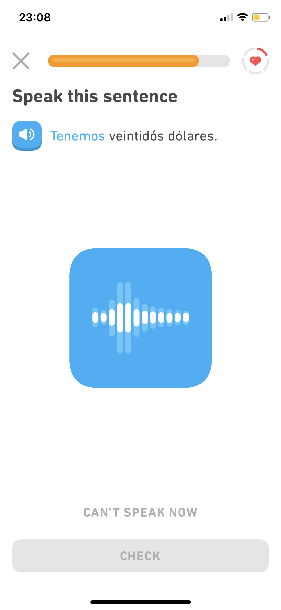

# Spreek-spellen

> Afbeelding 1. van der Zwaag, G. \(2017, 21 december\). Google Home mini review. Geraadpleegd op 30 maart 2019, van: [https://www.iculture.nl/reviews/google-home-mini-review/](https://www.iculture.nl/reviews/google-home-mini-review/)
>
> Afbeelding 2. Lakich, R. \(2019, 29 januari\). Lily chinese smart speaker. Geraadpleegd op 12 mei 2019, van: [https://mashable.com/shopping/lily-chinese-smart-speaker-indiegogo-campaign/?europe=true](https://mashable.com/shopping/lily-chinese-smart-speaker-indiegogo-campaign/?europe=true)
>
> Afbeelding 3. \[eigen screenshot\]. Geraadpleegd op 20 april 2019 van Duolingo.

